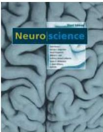

THE COVER
Dorsal view of the human brain.
(Courtesy of S.
Mark Williams.)

NEUROSCIENCE: Third Edition
Copyright © 2004 by Sinauer Associates, Inc.
All rights reserved.
This book may not be reproduced in whole or in part without permission.

Address inquiries and orders to
Sinauer Associates, Inc.
23 Plumtree Road
Sunderland, MA 01375 U.S.A.

www.sinauer.com
FAX: 413-549-1118
orders@sinauer.com
publish@sinauer.com

Library of Congress Cataloging-in-Publication Data
Neuroscience / edited by Dale Purves ...
[et al.].— 3rd ed.
p.
; cm.
Includes bibliographical references and index.
ISBN 0-87893-725-0 (casebound : alk.
paper)
1.
Neurosciences.
[DNLM: 1.
Nervous System Physiology.
2.
Neurochemistry.
WL 102 N50588 2004] I.
Purves, Dale.
QP355.2.N487 2004
612.8—dc22
2004003973

Printed in U.S.A.
5 4 3 2 1