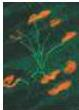

Contents xi

A Synopsis of Auditory Function 285

Box A Four Causes of Acquired Hearing Loss 285

Box B Music 286

The External Ear 287

The Middle Ear 289

The Inner Ear 289

Box C Sensorineural Hearing Loss and Cochlear Implants 290

Box D The Sweet Sound of Distortion 295

Hair Cells and the Mechanoelectrical Transduction of Sound Waves 294

Two Kinds of Hair Cells in the Cochlea 300

Tuning and Timing in the Auditory Nerve 301

How Information from the Cochlea Reaches Targets in the Brainstem 303

Integrating Information from the Two Ears 303

Monaural Pathways from the Cochlear Nucleus to the Lateral Lemniscus 307

Integration in the Inferior Colliculus 307

The Auditory Thalamus 308

The Auditory Cortex 309

Box E Representing Complex Sounds in the Brains of Bats and Humans 310

Summary 313

## Chapter 13 The Vestibular System 315

Overview 315

The Vestibular Labyrinth 315

Vestibular Hair Cells 316

The Otolith Organs: The Utricle and Saccule 317

Box A A Primer on Vestibular Navigation 318

Box B Adaptation and Tuning of Vestibular Hair Cells 320

How Otolith Neurons Sense Linear Forces 322

The Semicircular Canals 324

How Semicircular Canal Neurons Sense Angular Accelerations 325

Box C Throwing Cold Water on the Vestibular System 326

Central Pathways for Stabilizing Gaze, Head, and Posture 328

Vestibular Pathways to the Thalamus and Cortex 331

Box D Mauthner Cells in Fish 332

Summary 333

## Chapter 14 The Chemical Senses 337

Overview 337

The Organization of the Olfactory System 337

Olfactory Perception in Humans 339

Physiological and Behavioral Responses to Odorants 341

The Olfactory Epithelium and Olfactory Receptor Neurons 342

Box A Olfaction, Pheromones, and Behavior in the Hawk Moth 344

The Transduction of Olfactory Signals 345

Odorant Receptors 346

Olfactory Coding 348

The Olfactory Bulb 350

Box B Temporal "Coding" of Olfactory Information in Insects 350

Central Projections of the Olfactory Bulb 353

The Organization of the Taste System 354

Taste Perception in Humans 356

Idiosyncratic Responses to Tastants 357

The Organization of the Peripheral Taste System 359

Taste Receptors and the Transduction of Taste Signals 360

Neural Coding in the Taste System 362

Trigeminal Chemoreception 363

Summary 366

## Unit III MOVEMENT AND ITS CENTRAL CONTROL

## Chapter 15 Lower Motor Neuron Circuits and Motor Control 371

Overview 371

Neural Centers Responsible for Movement 371

Motor Neuron-Muscle Relationships 373

The Motor Unit 375

The Regulation of Muscle Force 377

The Spinal Cord Circuitry Underlying Muscle Stretch Reflexes 379