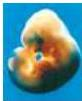

Contents xiii

Central Control of Visceral Motor Functions 483
Box A The Hypothalamus 484
Neurotransmission in the Visceral Motor System 487
Box B Horner's Syndrome 488
Box C Obesity and the Brain 490

Visceral Motor Reflex Functions 491
Autonomic Regulation of Cardiovascular Function 491
Autonomic Regulation of the Bladder 493
Autonomic Regulation of Sexual Function 496
Summary 498

# Unit IV THE CHANGING BRAIN

## Chapter 21 Early Brain Development 501

Overview 501
The Initial Formation of the Nervous System: Gastrulation and Neurulation 501
The Molecular Basis of Neural Induction 503
Box A Stem Cells: Promise and Perils 504
Box B Retinoic Acid: Teratogen and Inductive Signal 506
Formation of the Major Brain Subdivisions 510
Box C Homeotic Genes and Human Brain Development 513
Box D Rhombomeres 514
Genetic Abnormalities and Altered Human Brain Development 515
The Initial Differentiation of Neurons and Glia 516
Box E Neurogenesis and Neuronal Birthdating 517
The Generation of Neuronal Diversity 518
Neuronal Migration 520
Box F Mixing It Up: Long-Distance Neuronal Migration 524
Summary 525

## Chapter 22 Construction of Neural Circuits 527

Overview 527
The Axonal Growth Cone 527
Non-Diffusible Signals for Axon Guidance 528
Box A Choosing Sides: Axon Guidance at the Optic Chiasm 530
Diffusible Signals for Axon Guidance: Chemoattraction and Repulsion 534
The Formation of Topographic Maps 537
Selective Synapse Formation 539

## Box B Molecular Signals That Promote Synapse Formation 542

Trophic Interactions and the Ultimate Size of Neuronal Populations 543
Further Competitive Interactions in the Formation of Neuronal Connections 545
Molecular Basis of Trophic Interactions 547
Box C Why Do Neurons Have Dendrites? 548
Box D The Discovery of BDNF and the Neurotrophin Family 552
Neurotrophin Signaling 553
Summary 554

## Chapter 23 Modification of Brain Circuits as a Result of Experience 557

Overview 557
Critical Periods 557
Box A Built-In Behaviors 558
The Development of Language:
Example of a Human Critical Period 559
Box B Birdsong 560
Critical Periods in Visual System Development 562
Effects of Visual Deprivation on Ocular Dominance 563
Box C Transneuronal Labeling with Radioactive Amino Acids 564
Visual Deprivation and Amblyopia in Humans 568
Mechanisms by which Neuronal Activity Affects the Development of Neural Circuits 569
Cellular and Molecular Correlates of Activity-Dependent Plasticity during Critical Periods 572
Evidence for Critical Periods in Other Sensory Systems 572
Summary 573