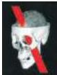

xiv Contents

# Chapter 24 Plasticity of Mature Synapses and Circuits 575

Overview 575

Synaptic Plasticity Underlies Behavioral Modification in Invertebrates 575

Box A Genetics of Learning and Memory in the Fruit Fly 581

Short-Term Synaptic Plasticity in the Mammalian Nervous System 582

Long-Term Synaptic Plasticity in the Mammalian Nervous System 583

Long-Term Potentiation of Hippocampal Synapses 584

Molecular Mechanisms Underlying LTP 587

Box B Dendritic Spines 590

Long-Term Synaptic Depression 592

Box C Silent Synapses 594

Changes in Gene Expression Cause Enduring Changes in Synaptic Function during LTP and LTD 597

Plasticity in the Adult Cerebral Cortex 599

Box D Epilepsy: The Effect of Pathological Activity on Neural Circuitry 600

Recovery from Neural Injury 602

Generation of Neurons in the Adult Brain 605

Box E Why Aren't We More Like Fish and Frogs? 606

Summary 609

# Unit V COMPLEX BRAIN FUNCTIONS

# Chapter 25 The Association Cortices 613

Overview 613

The Association Cortices 613

An Overview of Cortical Structure 614

Specific Features of the Association Cortices 615

Box A A More Detailed Look at Cortical Lamination 617

Lesions of the Parietal Association Cortex: Deficits of Attention 619

Lesions of the Temporal Association Cortex: Deficits of Recognition 622

Lesions of the Frontal Association Cortex: Deficits of Planning 623

Box B Psychosurgery 625

"Attention Neurons" in the Monkey Parietal Cortex 626

"Recognition Neurons" in the Monkey Temporal Cortex 627

"Planning Neurons" in the Monkey Frontal Cortex 630

Box C Neuropsychological Testing 632

Box D Brain Size and Intelligence 634

Summary 635

# Chapter 26 Language and Speech 637

Overview 637

Language Is Both Localized and Lateralized 637

Aphasias 638

Box A Speech 640

Box B Do Other Animals Have Language? 642

Box C Words and Meaning 645

A Dramatic Confirmation of Language Lateralization 646

Anatomical Differences between the Right and Left Hemispheres 648

Mapping Language Functions 649

Box D Language and Handedness 650

The Role of the Right Hemisphere in Language 654

Sign Language 655

Summary 656

# Chapter 27 Sleep and Wakefulness 659

Overview 659

Why Do Humans (and Many Other Animals) Sleep? 659

Box A Styles of Sleep in Different Species 661