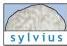
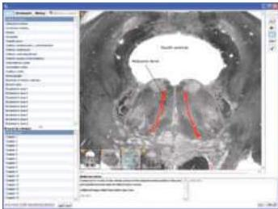

Supplements to Accompany NEUROSCIENCE Third Edition

# For the Student

Sylvius for Neuroscience:

A Visual Glossary of Human Neuroanatomy (CD-ROM)

S.
Mark Williams, Leonard E.
White, and Andrew C.
Mace

Sylvius for Neuroscience: A Visual Glossary of Human Neuroanatomy, included in every copy of the textbook, is an interactive CD reference guide to the structure of the human nervous system.
By entering a corresponding page number from the textbook, students can quickly search the CD for any neuroanatomical structure or term and view corresponding images and animations.
Descriptive information is provided with all images and animations.
Additionally, students can take notes on the content and share these with other Sylvius users.
Sylvius is an essential study aid for learning basic human neuroanatomy.

Sylvius for Neuroscience features:

- Over 400 neuroanatomical structures and terms.
- High-resolution images.
- Animations of pathways and 3-D reconstructions.
- Definitions and descriptions.
- Audio pronunciations.
- A searchable glossary.
- Categories of anatomical structures and terms (e.g., cranial nerves, spinal cord tracts, lobes, cortical areas, etc.), that can be easily browsed.
In addition, structures can be browsed by textbook chapter.