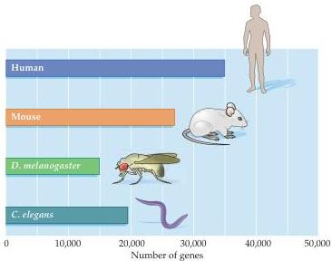

Chapter One

Figure 1.1 Estimates of the number of genes in the human genome, as well as in the genomes of the mouse, the fruit fly Drosophila melanogaster, and the nematode worm Caenorhabditis elegans.

the transcript of any gene is flanked by upstream (or  $5^{\prime}$ ) and downstream (or  $3^{\prime}$ ) regulatory sequences that control gene expression.
In addition, sequences between exons—called introns—further influence transcription.
Of the approximately 35,000 genes in the human genome, a majority are expressed in the developing and adult brain; the same is true in mice, flies, and worms—the species commonly used in modern genetics (and increasingly in neuroscience) (Figure 1.1).
Nevertheless, very few genes are uniquely expressed in neurons, indicating that nerve cells share most of the basic structural and functional properties of other cells.
Accordingly, most "brain-specific" genetic information must reside in the remainder of nucleic acid sequences—regulatory sequences and introns—that control the timing, quantity, variability and cellular specificity of gene expression.

One of the most promising dividends of sequencing the human genome has been the realization that one or a few genes, when altered (mutated), can begin to explain some aspects of neurological and psychiatric diseases.
Before the "postgenomic era" (which began following completion of the sequencing of the human genome), many of the most devastating brain diseases remained largely mysterious because there was little sense of how or why the normal biology of the nervous system was compromised.
The identification of genes correlated with disorders such as Huntington's disease, Parkinson's disease, Alzheimer's disease, major depression, and schizophrenia has provided a promising start to understanding these pathological processes in a much deeper way (and thus devising rational therapies).

Genetic and genomic information alone do not completely explain how the brain normally works or how disease processes disrupt its function.
To achieve these goals it is equally essential to understand the cell biology, anatomy, and physiology of the brain in health as well as disease.

# The Cellular Components of the Nervous System

Early in the nineteenth century, the cell was recognized as the fundamental unit of all living organisms.
It was not until well into the twentieth century, however, that neuroscientists agreed that nervous tissue, like all other organs, is made up of these fundamental units.
The major reason was that the first generation of "modern" neurobiologists in the nineteenth century had difficulty resolving the unitary nature of nerve cells with the microscopes and cell staining techniques that were then available.
This inade