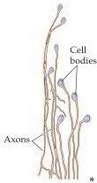
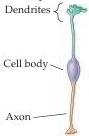
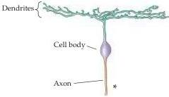
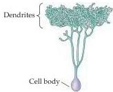
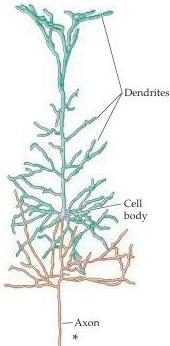
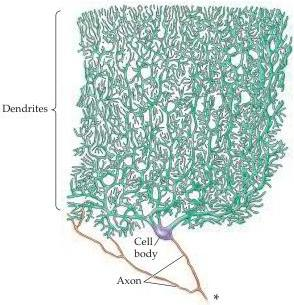

Studying the Nervous Systems of Humans and Other Animals 3

(A) Neurons in mesencephalic nucleus of cranial nerve V

(B) Retinal bipolar cell

(C) Retinal ganglion cell

(D) Retinal amacrine cell

(E) Cortical pyramidal cell

(F) Cerebellar Purkinje cells
Figure 1.2 Examples of the rich variety of nerve cell morphologies found in the human nervous system.
Tracings are from actual nerve cells stained by impregnation with silver salts (the so-called Golgi technique, the method used in the classical studies of Golgi and Cajal).
Asterisks indicate that the axon runs on much farther than shown.
Note that some cells, like the retinal bipolar cell, have a very short axon, and that others, like the retinal amacrine cell, have no axon at all.
The drawings are not all at the same scale.

quacy was exacerbated by the extraordinarily complex shapes and extensive branches of individual nerve cells, which further obscured their resemblance to the geometrically simpler cells of other tissues (Figures 1.2–1.4).
As a result, some biologists of that era concluded that each nerve cell was connected to its neighbors by protoplasmic links, forming a continuous nerve cell network, or reticulum.
The “reticular theory” of nerve cell communication, which was championed by the Italian neuropathologist Camillo Golgi (for whom the Golgi apparatus in cells is named), eventually fell from favor and was replaced by what came to be known as the “neuron doctrine.” The major proponents of this new perspective were the Spanish neuroanatomist Santiago Ramón y Cajal and the British physiologist Charles Sherrington.

The contrasting views represented by Golgi and Cajal occasioned a spirited debate in the early twentieth century that set the course of modern neuroscience.
Based on light microscopic examination of nervous tissue stained with silver salts according to a method pioneered by Golgi, Cajal argued persuasively that nerve cells are discrete entities, and that they communicate