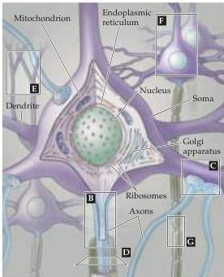
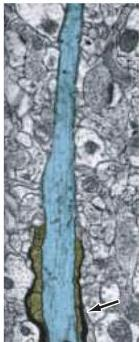
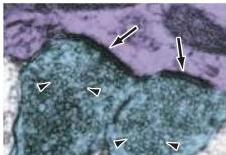
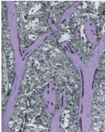
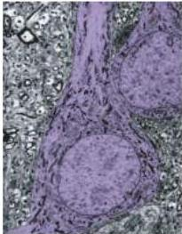
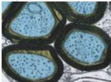
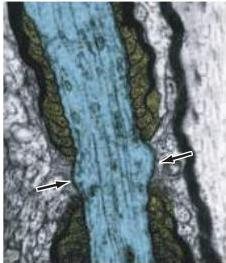

Studying the Nervous Systems of Humans and Other Animals 5

(A)

(B) Axon

(C) Synaptic endings (terminal boutons)

(E) Dendrites

(F) Neuronal cell body (soma)

(D) Myelinated axons

(G) Myelinated axon and node of Ranvier

Figure 1.3 The major light and electron microscopical features of neurons.
(A) Diagram of nerve cells and their component parts.
(B) Axon initial segment (blue) entering a myelin sheath (gold).
(C) Terminal boutons (blue) loaded with synaptic vesicles (arrowheads) forming synapses (arrows) with a dendrite (purple).
(D) Transverse section of axons (blue) ensheathed by the processes of oligodendrocytes (gold).
(E) Apical dendrites (purple) of cortical pyramidal cells.
(F) Nerve cell bodies (purple) occupied by large round nuclei.
(G) Portion of a myelinated axon (blue) illustrating the intervals between adjacent segments of myelin (gold) referred to as nodes of Ranvier (arrows).
(Micrographs from Peters et al., 1991.)