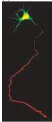
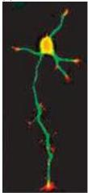
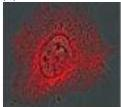
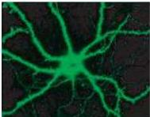
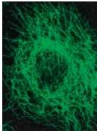
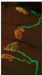
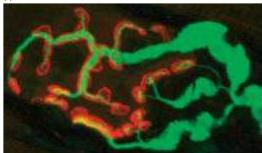
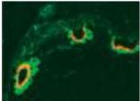
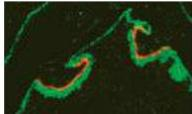

Chapter One

Figure 1.4 Distinctive arrangement of cytoskeletal elements in neurons.
(A) The cell body, axons, and dendrites are distinguished by the distribution of tubulin (green throughout cell) versus other cytoskeletal elements—in this case, Tau (red), a microtubule-binding protein found only in axons.
(B) The strikingly distinct localization of actin (red) to the growing tips of axonal and dendritic processes is shown here in cultured neuron taken from the hippocampus.
(C) In contrast, in a cultured epithelial cell, actin (red) is distributed in fibrils that occupy most of the cell body.
(D) In astroglial cells in culture, actin (red) is also seen in fibrillar bundles.
(E) Tubulin (green) is seen throughout the cell body and dendrites of neurons.
(F) Although tubulin is a major component of dendrites, extending into spines, the head of the spine is enriched in actin (red).
(G) The tubulin component of the cytoskeleton in nonneuronal cells is arrayed in filamentous networks.
(H-K) Synapses have a distinct arrangement of cytoskeletal elements, receptors, and scaffold proteins.
(H) Two axons (green; tubulin) from motor neurons are seen issuing two branches each to four muscle fibers.
The red shows the clustering of postsynaptic receptors (in this case for the neurotransmitter acetylcholine).
(I) A higher power view of a single motor neuron synapse shows the relationship between the axon (green) and the postsynaptic receptors (red).
(J) The extracellular space between the axon and its target muscle is shown in green.
(K) The clustering of scaffolding proteins (in this case, dystrophin) that localize receptors and link them to other cytoskeletal elements is shown in green.
(A courtesy of Y.
N.
Jan; B courtesy of E.
Dent and F.
Gertler; C courtesy of D.
Arneman and C.
Otey; D courtesy of A.
Gonzales and R.
Cheney; E from Sheng, 2003; F from Matus, 2000; G courtesy of T.
Salmon et al.; H-K courtesy of R.
Sealock.)

(A)

(C)

(E)

(G)

(F)

(I)

(J)

(K)