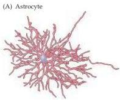
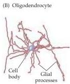
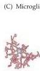
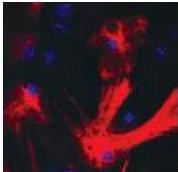
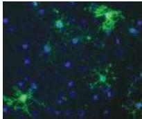
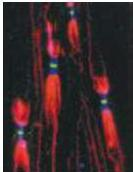
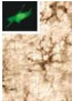

Chapter One

synapse in the nervous system.
Another type, the electrical synapse, is far more rare (see Chapter 5).
The secretory organelles in the presynaptic terminal of chemical synapses are synaptic vesicles (see Figure 1.3), which are generally spherical structures filled with neurotransmitter molecules.
The positioning of synaptic vesicles at the presynaptic membrane and their fusion to initiate neurotransmitter release is regulated by a number of proteins either within or associated with the vesicle.
The neurotransmitters released from synaptic vesicles modify the electrical properties of the target cell by binding to neurotransmitter receptors (Figure 1.4), which are localized primarily at the postsynaptic specialization.

The intricate and concerted activity of neurotransmitters, receptors, related cytoskeletal elements, and signal transduction molecules are thus the basis for nerve cells communicating with one another, and with effector cells in muscles and glands.

# Neuroglial Cells

Neuroglial cells—also referred to as glial cells or simply glia—are quite different from nerve cells.
Glia are more numerous than neurons in the brain, outnumbering them by a ratio of perhaps 3 to 1.
The major distinction is that glia do not participate directly in synaptic interactions and electrical signaling, although their supportive functions help define synaptic contacts and maintain the signaling abilities of neurons.
Although glial cells also have complex processes extending from their cell bodies, these are generally less prominent than neuronal branches, and do not serve the same purposes as axons and dendrites (Figure 1.5).

Figure 1.5 Varieties of neuroglial cells.
Tracings of an astrocyte (A), an oligodendrocyte (B), and a microglial cell (C) visualized using the Golgi method.
The images are at approximately the same scale.
(D) Astrocytes in tissue culture, labeled (red) with an antibody against an astrocyte-specific protein.
(E) Oligodendroglial cells in tissue culture labeled with an antibody against an oligodendroglial-specific protein.
(F) Peripheral axon are ensheathed by myelin (labeled red) except at a distinct region called the node of Ranvier.
The green label indicates ion channels concentrated in the node; the blue label indicates a molecularly distinct region called the paranode.
(G) Microglial cells from the spinal cord, labeled with a cell type-specific antibody.
Inset: Higher-magnification image of a single microglial cell labeled with a macrophage-selective marker.
(A-C after Jones and Cowan, 1983; D, E courtesy of A.-S.
LaMantia; F courtesy of M.
Bhat; G courtesy of A.
Light; inset courtesy of G.
Matsushima.)

(D)

(E)

(F)

(G)