Chapter One

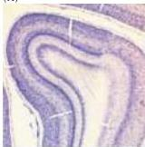
(A)

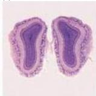
(B)

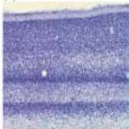
(C)

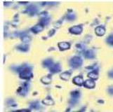
(D)

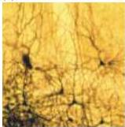
(E)

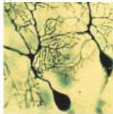
(F)

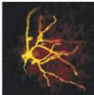
(G)

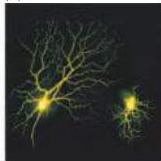
(H)

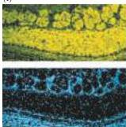
(I)

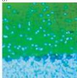
(J)

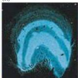
(K)

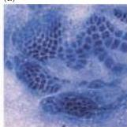
(L)

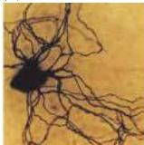
(M)

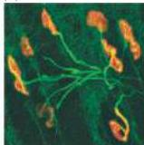
(N)

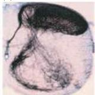
(O)

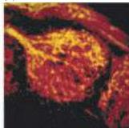
(P)

showed mainly differences in cell size and distribution, antibody stains and probes for messenger RNA added greatly to the appreciation of distinctive types of neurons and glia in various regions of the nervous system.
At the same time, new tract tracing methods using a wide variety of tracing substances allowed the interconnections among specific groups of neurons to be