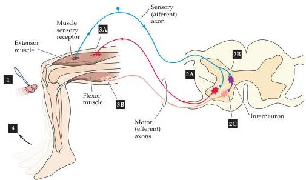
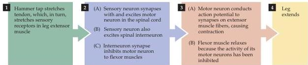

Chapter One

Figure 1.7 A simple reflex circuit, the knee-jerk response (more formally, the myotatic reflex), illustrates several points about the functional organization of neural circuits.
Stimulation of peripheral sensors (a muscle stretch receptor in this case) initiates receptor potentials that trigger action potentials that travel centrally along the afferent axons of the sensory neurons.
This information stimulates spinal motor neurons by means of synaptic contacts.
The action potentials triggered by the synaptic potential in motor neurons travel peripherally in efferent axons, giving rise to muscle contraction and a behavioral response.
One of the purposes of this particular reflex is to help maintain an upright posture in the face of unexpected changes.

carry information toward the brain or spinal cord (or farther centrally within the spinal cord and brain) are called afferent neurons; nerve cells that carry information away from the brain or spinal cord (or away from the circuit in question) are called efferent neurons.
Interneurons or local circuit neurons only participate in the local aspects of a circuit, based on the short distances over which their axons extend.
These three functional classes—afferent neurons, efferent neurons, and interneurons—are the basic constituents of all neural circuits.

A simple example of a neural circuit is the ensemble of cells that subserves the myotatic spinal reflex (the "knee-jerk" reflex; Figure 1.7).
The afferent neurons of the reflex are sensory neurons whose cell bodies lie the dorsal root ganglia and whose peripheral axons terminate in sensory endings in skeletal muscles (the ganglia that serve this same of function for much of the head and neck are called cranial nerve ganglia; see Appendix A).
The central axons of these afferent sensory neurons enter the spinal cord where they terminate on a variety of central neurons concerned with the regulation of muscle tone, most obviously the motor neurons that determine the activity of the related muscles.
These neurons constitute the efferent neurons as well as interneurons of the circuit.
One group of these efferent neurons in the ventral horn of the spinal cord projects to the flexor muscles in the limb, and the other to extensor muscles.
Spinal cord interneurons are the third element of this circuit.
The interneurons receive synaptic contacts from sensory afferent neurons and make synapses on the efferent motor neurons that project to the