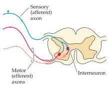
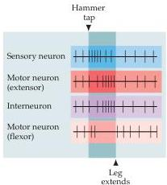

Studying the Nervous Systems of Humans and Other Animals 13

Figure 1.8 Relative frequency of action potentials (indicated by individual vertical lines) in different components of the myotatic reflex as the reflex pathway is activated.
Notice the modulatory effect of the interneuron.

flexor muscles; therefore they are capable of modulating the input–output linkage.
The excitatory synaptic connections between the sensory afferents and the extensor efferent motor neurons cause the extensor muscles to contract; at the same time, the interneurons activated by the afferents are inhibitory, and their activation diminishes electrical activity in flexor efferent motor neurons and causes the flexor muscles to become less active (Figure 1.8).
The result is a complementary activation and inactivation of the synergist and antagonist muscles that control the position of the leg.

A more detailed picture of the events underlying the myotatic or any other circuit can be obtained by electrophysiological recording (Figure 1.9).
There are two basic approaches to measuring the electrical activity of a nerve cell: extracellular recording (also referred to as single-unit recording), where an electrode is placed near the nerve cell of interest to detect its activity; and intracellular recording, where the electrode is placed inside the cell.
Extracellular recordings primarily detect action potentials, the all-or-nothing changes in the potential across nerve cell membranes that convey information from one point to another in the nervous system.
This sort of recording is particularly useful for detecting temporal patterns of action potential activity and relating those patterns to stimulation by other inputs, or to specific behavioral events.
Intracellular recordings can detect the smaller, graded potential changes that trigger action potentials, and thus allow a more detailed analysis of communication between neurons within a circuit.
These graded triggering potentials can arise at either sensory receptors or synapses and are called receptor potentials or synaptic potentials, respectively.

For the myotatic circuit, electrical activity can be measured both extracellularly and intracellularly, thus defining the functional relationships between neurons in the circuit.
The pattern of action potential activity can be measured for each element of the circuit (afferents, efferents, and interneurons) before, during, and after a stimulus (see Figure 1.8).
By comparing the onset, duration, and frequency of action potential activity in each cell, a functional picture of the circuit emerges.
As a result of the stimulus, the sensory neuron is triggered to fire at higher frequency (i.e., more action potentials per unit time).
This increase triggers a higher frequency of action potentials in both the extensor motor neurons and the interneurons.
Concurrently, the inhibitory synapses made by the interneurons onto the flexor motor neurons cause the frequency of action potentials in these cells to decline.
Using intracellular recording, it is possible to observe directly the potential changes underlying the synaptic connections of the myotatic reflex circuit (see Figure 1.9).