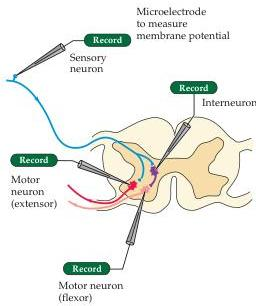
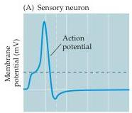
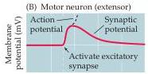
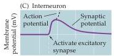
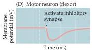

Chapter One

Figure 1.9 Intracellularly recorded responses underlying the myotatic reflex.
(A) Action potential measured in a sensory neuron.
(B) Postsynaptic triggering potential recorded in an extensor motor neuron.
(C) Postsynaptic triggering potential in an interneuron.
(D) Postsynaptic inhibitory potential in a flexor motor neuron.
Such intracellular recordings are the basis for understanding the cellular mechanisms of action potential generation, and the sensory receptor and synaptic potentials that trigger these conducted signals.

# Overall Organization of the Human Nervous System

When considered together, circuits that process similar types of information comprise neural systems that serve broader behavioral purposes.
The most general functional distinction divides such collections into sensory systems that acquire and process information from the environment (e.g., the visual system or the auditory system, see Unit II), and motor systems that respond to such information by generating movements and other behavior (see Unit III).
There are, however, large numbers of cells and circuits that lie between these relatively well-defined input and output systems.
These are collectively referred to as associational systems, and they mediate the most complex and least well-characterized brain functions (see Unit V).

In addition to these broad functional distinctions, neuroscientists and neurologists have conventionally divided the vertebrate nervous system anatomically into central and peripheral components (Figure 1.10).
The central nervous system, typically referred to as the CNS, comprises the brain (cerebral hemispheres, diencephalon, cerebellum, and brainstem) and the spinal cord (see Appendix A for more information about the gross anatomical features of the CNS).
The peripheral nervous system (PNS) includes the sensory neurons that link sensory receptors on the body surface or deeper within it with relevant processing circuits in the central nervous system.
The motor portion of the peripheral nervous system in turn consists of two components.
The motor axons that connect the brain and spinal cord to skeletal