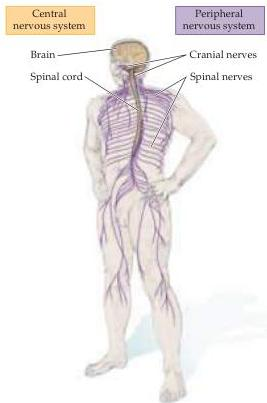
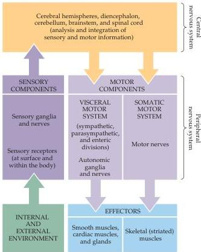

Studying the Nervous Systems of Humans and Other Animals 15

(A)

(B)
Figure 1.10 The major components of the nervous system and their functional relationships.
(A) The CNS (brain and spinal cord) and PNS (spinal and cranial nerves).
(B) Diagram of the major components of the central and peripheral nervous systems and their functional relationships.
Stimuli from the environment convey information to processing circuits within the brain and spinal cord, which in turn interpret their significance and send signals to peripheral effectors that move the body and adjust the workings of its internal organs.

muscles make up the somatic motor division of the peripheral nervous system, whereas the cells and axons that innervate smooth muscles, cardiac muscle, and glands make up the visceral or autonomic motor division.

Those nerve cell bodies that reside in the peripheral nervous system are located in ganglia, which are simply local accumulations of nerve cell bodies (and supporting cells).
Peripheral axons are gathered into bundles called nerves, many of which are enveloped by the glial cells of the peripheral nervous system called Schwann cells.
In the central nervous system, nerve cells are arranged in two different ways.
Nuclei are local accumulations of neurons having roughly similar connections and functions; such collections are found throughout the cerebrum, brainstem and spinal cord.
In contrast, cortex (plural, cortices) describes sheet-like arrays of nerve cells (again, consult Appendix A for additional information and illustrations).
The cortices of the cerebral hemispheres and of the cerebellum provide the clearest example of this organizational principle.

Axons in the central nervous system are gathered into tracts that are more or less analogous to nerves in the periphery.
Tracts that cross the midline of the brain are referred to as commissures.
Two gross histological terms distinguish regions rich in neuronal cell bodies versus regions rich in axons.
Gray matter refers to any accumulation of cell bodies and neuropil in the brain and spinal cord (e.g., nuclei or cortices), whereas white matter, named for its relatively light appearance resulting from the lipid content of myelin, refers to axon tracts and commissures.