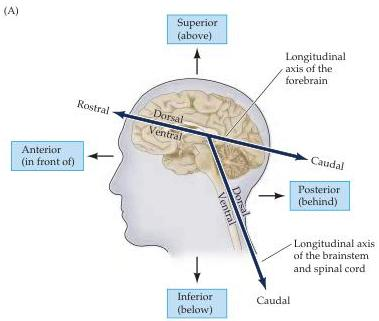
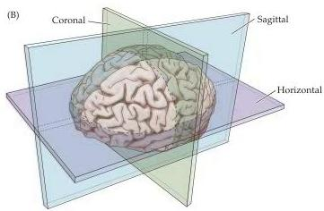
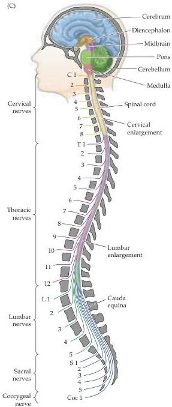

Studying the Nervous Systems of Humans and Other Animals 17

or more lateral (parasagittal).
Sections in the plane of the face are called coronal or frontal.
Different terms are usually used to refer to sections of the spinal cord.
The plane of section orthogonal to the long axis of the cord is called transverse, whereas sections parallel to the long axis of the cord are called longitudinal.
In a transverse section through the human spinal cord, the dorsal and ventral axes and the anterior and posterior axes indicate the same directions (see Figure 1.11).
Tedious though this terminology may be, it

