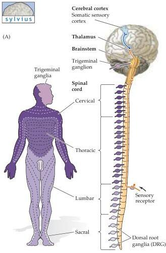
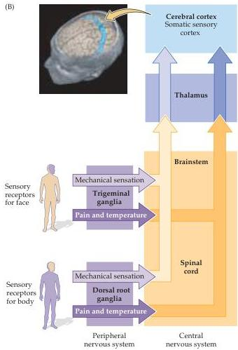

Studying the Nervous Systems of Humans and Other Animals 21

(A)

(B)
Figure 1.13 The anatomical and functional organization of the somatic sensory system.
Central nervous system components of the somatic sensory system are found in the spinal cord, brainstem, thalamus, and cerebral cortex.
(A) Somatosensory information from the body surface is mapped onto dorsal root ganglia (DRG), schematically depicted here as attachments to the spinal cord.
The various shades of purple indicate correspondence between regions of the body and the DRG that relay information from the body surface to the central nervous system.
Information from the head and neck is relayed to the CNS via the trigeminal ganglia.
(B) Somatosensory information travels from the peripheral sensory receptors via parallel pathways for mechanical sensation and for the sensation of pain and temperature.
These parallel pathways relay through the spinal cord and brainstem, ultimately sending sensory information to the thalamus, from which it is relayed to the somatic sensory cortex in the postcentral gyrus (indicated in blue in the image of the whole brain; MRI courtesy of L.
E.
White, J.
Vovoydic, and S.
M.
Williams).

system.
Thus, adjacent areas on the body surface are mapped to adjacent regions in nuclei, in white matter tracts, and in the thalamic and cortical targets of the system.
Beginning in the periphery, the cells in each dorsal root ganglion define a discrete dermatome (the area of the skin innervated by the processes of cells from a single dorsal root).
In the spinal cord, from caudal to rostral, the dermatomes are represented in corresponding regions of the spinal cord from sacral (back) to lumbar (legs) to thoracic (chest) and cervical (arms and shoulders) (see Figures 1.13 and 1.11C).
This so-called somatotopy is maintained in the somatic sensory tracts in spinal cord and brainstem that convey information to the relevant forebrain structures of the somatic sensory system (Figure 1.14).

Parallel pathways refer to the segregation of nerve cell axons that process the distinct stimulus attributes that comprise a particular sensory, motor, or cognitive modality.
For somatic sensation, the stimulus attributes relayed via parallel pathways are pain, temperature, touch, pressure, and proprioception (the sense of joint or limb position).
From the dorsal root ganglia, through