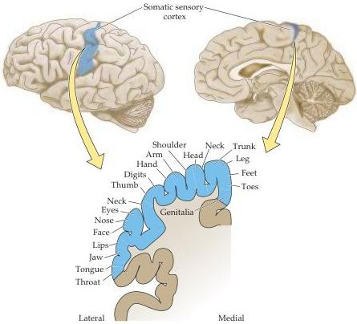

Chapter One

the spinal cord and brainstem, and on to the somatic sensory cortex, these submodalities are kept largely segregated.
Thus anatomically, biochemically, and physiologically distinct neurons transduce, encode, and relay pain, temperature, and mechanical information.
Although this information is subsequently integrated to provide unitary perception of the relevant stimuli, neurons and circuits in the somatic sensory system are clearly specialized to process discrete aspects of somatic sensation.

This basic outline of the organization of the somatic system is representative of the principles pertinent to understanding any neural system.
It will in every case be pertinent to consider the anatomical distribution of neural circuits dedicated to a particular function, how the function is represented or "mapped" onto the neural elements within the system, and how distinct stimulus attributes are segregated within subsets of neurons that comprise the system.
Such details provide a framework for understanding how activity within the system provides a representation of relevant stimulus, the required motor response, and higher order cognitive correlates.

Figure 1.14 Somatotopic organization of sensory information.
(Top) The locations of primary and secondary somatosensory cortical areas on the lateral surface of the brain.
(Bottom) Cortical representation of different regions of skin.

