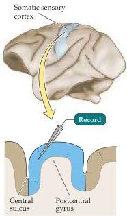
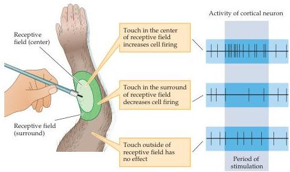

Studying the Nervous Systems of Humans and Other Animals 23

# Functional Analysis of Neural Systems

A wide range of physiological methods is now available to evaluate the electrical (and metabolic) activity of the neuronal circuits that make up a neural system.
Two approaches, however, have been particularly useful in defining how neural systems represent information.
The most widely used method is single-cell, or single-unit electrophysiological recording with microelectrodes (see above; this method often records from several nearby cells in addition to the one selected, providing further useful information).
The use of microelectrodes to record action potential activity provides a cell-by-cell analysis of the organization topographic maps (Figure 1.15), and can give specific insight into the type of stimulus to which the neuron is "tuned" (i.e., the stimulus that elicits a maximal change in action potential activity from the baseline state).
Single-unit analysis is often used to define a neuron's receptive field—the region in sensory space (e.g., the body surface, or a specialized structure such as the retina) within which a specific stimulus elicits the greatest action potential response.
This approach to understanding neural systems was introduced by Stephen Kuffler and Vernon Mountcastle in the early 1950s and has now been used by several generations of neuroscientists to evaluate the relationship between stimuli and neuronal responses in both sensory and motor systems.
Electrical recording techniques

(A)

(B)
Figure 1.15 Single-unit electrophysiological recording from cortical pyramidal neuron, showing the firing pattern in response to a specific peripheral stimulus.
(A) Typical experimental set-up.
(B) Defining neuronal receptive fields.