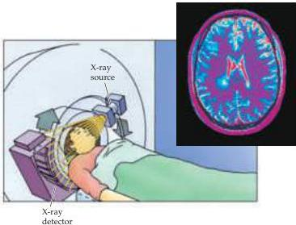

Studying the Nervous Systems of Humans and Other Animals 25

# Box A

## Brain Imaging Techniques

In the 1970s, computerized tomography, or CT, opened a new era in noninvasive imaging by introducing the use of computer processing technology to help probe the living brain.
Prior to CT, the only brain imaging technique available was standard X-ray film, which has poor soft tissue contrast and involves relatively high radiation exposure.

The CT approach uses a narrow X-ray beam and a row of very sensitive detectors placed on opposite sides of the head to probe just a small portion of tissue at a time with limited radiation exposure (see Figure A).
In order to make an image, the X-ray tube and detectors rotate around the head to collect radiodensity information from every orientation around a narrow slice.
Computer processing techniques then calculate the radiodensity of each point within the slice plane, producing a tomographic image (tomo means "cut" or "slice").
If the patient is slowly moved through the scanner while the X-ray tube rotates in this way, a three-dimensional radiodensity matrix can be created, allowing images to be computed for any plane through the brain.
CT scans can readily distinguish gray matter and white matter, differentiate the ventricles quite well, and show many other brain structures with a spatial resolution of several millimeters.

Brain imaging took another large step forward in the 1980s with the development of magnetic resonance imaging (MRI).
MRI is based on the fact that the nuclei of some atoms act as spinning magnets, and that if they are placed in a strong magnetic field they will line up with the field and spin at a frequency that is dependent on the field strength.
If they then receive a brief radiofrequency pulse tuned to their spinning frequency they are knocked out of alignment with the field, and subsequently emit energy in an oscillatory fashion as they gradually realign themselves with the field.
The strength of the emitted signal depends on how many nuclei are involved in this process.
To get spatial information in MRI, the magnetic field is distorted slightly by imposing magnetic gradients along three different spatial axes so that only nuclei at certain locations are tuned to the detector's frequency at any given time.
Almost all MRI scanners use detectors tuned to the radio frequencies of spinning hydrogen nuclei in water molecules, and thus create images based on the distribution of water in different tissues.
Careful manipulation of magnetic field gradients and radiofrequency pulses make it possible to construct extraordinarily detailed images of the brain at any location and orientation with sub-millimeter resolution.

The strong magnetic field and radiofrequency pulses used in MRI scanning are harmless, making this technique completely noninvasive (although metal objects in or near a scanner are a safety concern) (see Figure B).
MRI is also extremely versatile because, by changing the scanning parameters, images based on a wide variety of different contrast mechanisms can be generated.
For example, conventional MR images take advantage of the fact that hydrogen in different types of tissue (e.g., gray matter, white matter, cerebrospinal fluid) have slightly different realignment rates, meaning that soft tissue contrast can be manipulated simply by adjusting when the realigning hydrogen signal is measured.
Different parameter settings can also be used to generate images in which gray and white matter are invisible but in which the brain vasculature stands out in sharp detail.
Safety and versatility have made MRI the technique of choice for imaging brain structure in most applications.

Imaging functional variations in the living brain has also become possible with the recent development of techniques for detecting small, localized

(continued)

(A) In computerized tomography, the X-ray source and detectors are moved around the patient's head.
The inset shows a horizontal CT section of a normal adult brain.