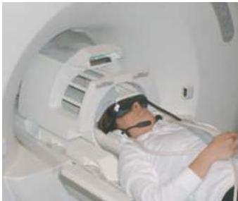

Chapter One

# Box A (continued)

## Brain Imaging Techniques

changes in metabolism or cerebral blood flow.
To conserve energy, the brain regulates its blood flow such that active neurons with relatively high metabolic demands receive more blood than relatively inactive neurons.
Detecting and mapping these local changes in cerebral blood flow forms the basis for three widely used functional brain imaging techniques: positron emission tomography (PET), single-photon emission computerized tomography (SPECT), and functional magnetic resonance imaging (fMRI).

In PET scanning, unstable positron-emitting isotopes are incorporated into different reagents (including water, precursor molecules of specific neurotransmitters, or glucose) and injected into the bloodstream.
Labeled oxygen and glucose quickly accumulate in more metabolically active areas, and labeled transmitter probes are taken up selectively by appropriate regions.
As the unstable isotope decays, it results in the emission of two positrons moving in opposite directions.
Gamma ray detectors placed around the head register a "hit" only when two detectors 180° apart react simultaneously.
Images of tissue isotope density can then be generated (much the way CT images are calculated) showing the location of active regions with a spatial resolution of about 4 mm.
Depending on the probe injected, PET imaging can be used to visualize activity-dependent changes in blood flow, tissue metabolism, or biochemical activity.
SPECT imaging is similar to PET in that it involves injection or inhalation of a radiolabeled compound (for example, ¹³³Xe or ¹²³I-labeled iodoamphetamine), which produce photons that are detected by a gamma camera moving rapidly around the head.

Functional MRI, a variant of MRI, currently offers the best approach for visualizing brain function based on local metabolism.
fMRI is predicated on the fact that hemoglobin in blood slightly distorts the magnetic resonance properties of hydrogen nuclei in its vicinity, and

(B) In MRI scanning, the head is placed in the center of a large magnet.
A radiofrequency antenna coil is placed around the head for exciting and recording the magnetic resonance signal.
For fMRI, stimuli can be presented using virtual reality video goggles and stereo headphones while inside the scanner.

# Summary

The brain can be studied by methods that range from genetics and molecular biology to behavioral testing of normal human subjects.
In addition to an ever-increasing store of knowledge about the anatomical organization of the nervous system, many of the brightest successes of modern neuroscience have come from understanding nerve cells as the basic structural and functional unit of the nervous system.
Studies of the distinct cellular architecture and molecular components of neurons and glia have revealed much about