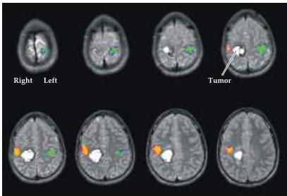
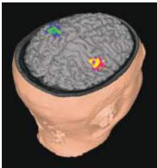

Studying the Nervous Systems of Humans and Other Animals 27

(C) MRI images of an adult patient with a brain tumor, with fMRI activity during a hand motion task superimposed (left hand activity is shown in yellow, right hand activity in green).
At right is a three-dimensional surface reconstructed view of the same data.

the amount of magnetic distortion changes depending on whether the hemoglobin has oxygen bound to it.
When a brain area is activated by a specific task it begins to use more oxygen and within seconds the brain microvasculature responds by increasing the flow of oxygen-rich blood to the active area.
These changes in the concentration of oxygen and blood flow lead to localized blood oxygenation level-dependent (BOLD) changes in the magnetic resonance signal.
Such fluctuations are detected using statistical image process

ing techniques to produce maps of task-dependent brain function (see Figure C).
Because fMRI uses signals intrinsic to the brain without any radioactivity, repeated observations can be made on the same individual—a major advantage over imaging methods such as PET.
The spatial resolution (2–3 mm) and temporal resolution (a few seconds) of fMRI are also superior to other functional imaging techniques.
MRI has thus emerged as the technology of choice for probing both the structure and function of the living human brain.

## References

HUETTEL, S.
A., A.
W.
SONG AND G.
McCARTHY (2004) Functional Magnetic Resonance Imaging.
Sunderland, MA: Sinauer Associates.
OLDENDORF, W.
AND W.
OLDENDORF JR.
(1988) Basics of Magnetic Resonance Imaging.
Boston: Kluwer Academic Publishers.
RAICHLE, M.
E.
(1994) Images of the mind: Studies with modern imaging techniques.
Ann.
Rev.
Psychol.
45: 333–356.
SCHILD, H.
(1990) MRI Made Easy (...Well, Almost).
Berlin: H.
Heineman.

their individual functions, as well as providing a basis for understanding how nerve cells are organized into circuits, and circuits into systems that process specific types of information pertinent to perception and action.
Goals that remain include understanding how basic molecular genetic phenomena are linked to cellular, circuit, and system functions; understanding how these processes go awry in neurological and psychiatric diseases; and beginning to understand the especially complex functions of the brain that make us human.
