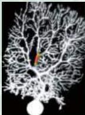

Calcium signaling in a cerebellar Purkinje neuron.
An electrode was used to fill the neuron with a fluorescent calcium indicator dye.
This dye revealed the release of intracellular calcium ions (color) produced by the actions of the second messenger  $\mathrm{IP}_3$ .
(Courtesy of Elizabeth A.
Finch and George J.
Augustine.)

# UNIT I

## NEURAL SIGNALING

2 Electrical Signals of Nerve Cells
3 Voltage-Dependent Membrane Permeability
4 Channels and Transporters
5 Synaptic Transmission
6 Neurotransmitters, Receptors, and Their Effects
7 Molecular Signaling within Neurons

The brain is remarkably adept at acquiring, coordinating, and disseminating information about the body and its environment.
Such information must be processed within milliseconds, yet it also can be stored away as memories that endure for years.
Neurons within the central and peripheral nervous systems perform these functions by generating sophisticated electrical and chemical signals.
This unit describes these signals and how they are produced.
It explains how one type of electrical signal, the action potential, allows information to travel along the length of a nerve cell.
It also explains how other types of signals—both electrical and chemical—are generated at synaptic connections between nerve cells.
Synapses permit information transfer by interconnecting neurons to form the circuitry on which neural processing depends.
Finally, it describes the intricate biochemical signaling events that take place within neurons.
Appreciating these fundamental forms of neuronal signaling provides a foundation for appreciating the higher-level functions considered in the rest of the book.

The cellular and molecular mechanisms that give neurons their unique signaling abilities are also targets for disease processes that compromise the function of the nervous system.
A working knowledge of the cellular and molecular biology of neurons is therefore fundamental to understanding a variety of brain pathologies, and for developing novel approaches to diagnosing and treating these all too prevalent problems.