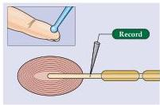
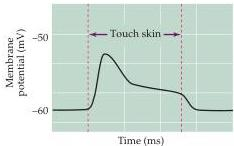
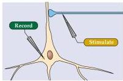
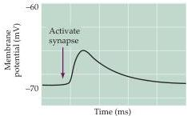
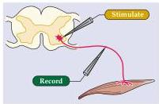
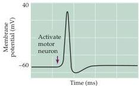

Chapter Two

Figure 2.1 Types of neuronal electrical signals.
In all cases, microelectrodes are used to measure changes in the resting membrane potential during the indicated signals.
(A) A brief touch causes a receptor potential in a Pacinian corpuscle in the skin.
(B) Activation of a synaptic contact onto a hippocampal pyramidal neuron elicits a synaptic potential.
(C) Stimulation of a spinal reflex produces an action potential in a spinal motor neuron.
(A) Receptor potential

(B) Synaptic potential

(C) Action potential

changes in potential are the first step in generating the sensation of vibrations (or "tickles") of the skin in the somatic sensory system (Chapter 8).
Similar sorts of receptor potentials are observed in all other sensory neurons during transduction of sensory signals (Unit II).

Another type of electrical signal is associated with communication between neurons at synaptic contacts.
Activation of these synapses generates synaptic potentials, which allow transmission of information from one neuron to another.
An example of such a signal is shown in Figure 2.1B.
In this case, activation of a synaptic terminal innervating a hippocampal pyramidal neuron causes a very brief change in the resting membrane potential in the pyramidal neuron.
Synaptic potentials serve as the means of exchanging information in complex neural circuits in both the central and peripheral nervous systems (Chapter 5).

The use of electrical signals—as in sending electricity over wires to provide power or information—presents a series of problems in electrical engineering.
A fundamental problem for neurons is that their axons, which can be quite long (remember that a spinal motor neuron can extend for a meter or more), are not good electrical conductors.
Although neurons and wires