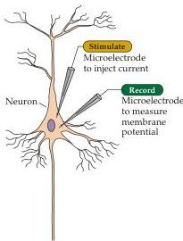
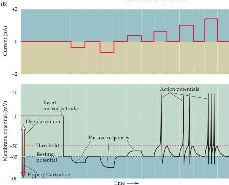

Electrical Signals of Nerve Cells 33

are both capable of passively conducting electricity, the electrical properties of neurons compare poorly to an ordinary wire.
To compensate for this deficiency, neurons have evolved a "booster system" that allows them to conduct electrical signals over great distances despite their intrinsically poor electrical characteristics.
The electrical signals produced by this booster system are called action potentials (which are also referred to as "spikes" or "impulses").
An example of an action potential recorded from the axon of a spinal motor neuron is shown in Figure 2.1C.

One way to elicit an action potential is to pass electrical current across the membrane of the neuron.
In normal circumstances, this current would be generated by receptor potentials or by synaptic potentials.
In the laboratory, however, electrical current suitable for initiating an action potential can be readily produced by inserting a second microelectrode into the same neuron and then connecting the electrode to a battery (Figure 2.2A).
If the current delivered in this way makes the membrane potential more negative (hyperpolarization), nothing very dramatic happens.
The membrane potential simply changes in proportion to the magnitude of the injected current (central part of Figure 2.2B).
Such hyperpolarizing responses do not require any unique property of neurons and are therefore called passive electrical responses.
A much more interesting phenomenon is seen if current of the opposite polarity is delivered, so that the membrane potential of the nerve cell becomes more positive than the resting potential (depolarization).
In this case, at a certain level of membrane potential, called the threshold potential, an action potential occurs (see right side of Figure 2.2B).

The action potential, which is an active response generated by the neuron, is a brief (about 1 ms) change from negative to positive in the transmem

(A)

(B)
Figure 2.2 Recording passive and active electrical signals in a nerve cell.
(A) Two microelectrodes are inserted into a neuron; one of these measures membrane potential while the other injects current into the neuron.
(B) Inserting the voltage-measuring microelectrode into the neuron reveals a negative potential, the resting membrane potential.
Injecting current through the current-passing microelectrode alters the neuronal membrane potential.
Hyperpolarizing current pulses produce only passive changes in the membrane potential.
While small depolarizing currents also elicit only passive responses, depolarizations that cause the membrane potential to meet or exceed threshold additionally evoke action potentials.
Action potentials are active responses in the sense that they are generated by changes in the permeability of the neuronal membrane.