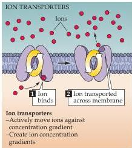
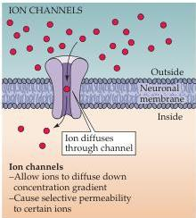

Chapter Two

brane potential.
Importantly, the amplitude of the action potential is independent of the magnitude of the current used to evoke it; that is, larger currents do not elicit larger action potentials.
The action potentials of a given neuron are therefore said to be all-or-none, because they occur fully or not at all.
If the amplitude or duration of the stimulus current is increased sufficiently, multiple action potentials occur, as can be seen in the responses to the three different current intensities shown in Figure 2.2B (right side).
It follows, therefore, that the intensity of a stimulus is encoded in the frequency of action potentials rather than in their amplitude.
This arrangement differs dramatically from receptor potentials, whose amplitudes are graded in proportion to the magnitude of the sensory stimulus, or synaptic potentials, whose amplitude varies according to the number of synapses activated and the previous amount of synaptic activity.

Because electrical signals are the basis of information transfer in the nervous system, it is essential to understand how these signals arise.
Remarkably, all of the neuronal electrical signals described above are produced by similar mechanisms that rely upon the movement of ions across the neuronal membrane.
The remainder of this chapter addresses the question of how nerve cells use ions to generate electrical potentials.
Chapter 3 explores more specifically the means by which action potentials are produced and how these signals solve the problem of long-distance electrical conduction within nerve cells.
Chapter 4 examines the properties of membrane molecules responsible for electrical signaling.
Finally, Chapters 5-7 consider how electrical signals are transmitted from one nerve cell to another at synaptic contacts.

## How Ionic Movements Produce Electrical Signals

Electrical potentials are generated across the membranes of neurons—and, indeed, all cells—because (1) there are differences in the concentrations of specific ions across nerve cell membranes, and (2) the membranes are selectively permeable to some of these ions.
These two facts depend in turn on two different kinds of proteins in the cell membrane (Figure 2.3).
The ion concentration gradients are established by proteins known as active transporters, which, as their name suggests, actively move ions into or out of cells against their concentration gradients.
The selective permeability of membranes is

Figure 2.3 Ion transporters and ion channels are responsible for ionic movements across neuronal membranes.
Transporters create ion concentration differences by actively transporting ions against their chemical gradients.
Channels take advantage of these concentration gradients, allowing selected ions to move, via diffusion, down their chemical gradients.

