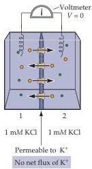
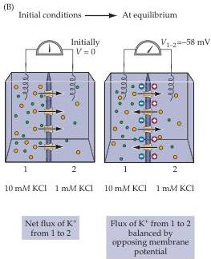
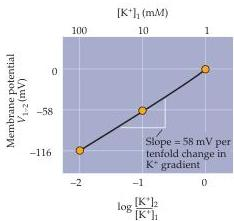

Electrical Signals of Nerve Cells 35

due largely to ion channels, proteins that allow only certain kinds of ions to cross the membrane in the direction of their concentration gradients.
Thus, channels and transporters basically work against each other, and in so doing they generate the resting membrane potential, action potentials, and the synaptic potentials and receptor potentials that trigger action potentials.
The structure and function of these channels and transporters are described in Chapter 4.

To appreciate the role of ion gradients and selective permeability in generating a membrane potential, consider a simple system in which an artificial membrane separates two compartments containing solutions of ions.
In such a system, it is possible to determine the composition of the two solutions and, thereby, control the ion gradients across the membrane.
For example, take the case of a membrane that is permeable only to potassium ions $(\mathrm{K}^{+})$.
If the concentration of $\mathrm{K}^{+}$ on each side of this membrane is equal, then no electrical potential will be measured across it (Figure 2.4A).
However, if the concentration of $\mathrm{K}^{+}$ is not the same on the two sides, then an electrical potential will be generated.
For instance, if the concentration of $\mathrm{K}^{+}$ on one side of the membrane (compartment 1) is 10 times higher than the $\mathrm{K}^{+}$ concentration on the other side (compartment 2), then the electrical potential of compartment 1 will be negative relative to compartment 2 (Figure 2.4B).
This difference in electrical potential is generated because the potassium ions flow down their concentration gradient and take their electrical charge (one positive charge per ion) with them as they go.
Because neuronal membranes contain pumps that accumulate $\mathrm{K}^{+}$ in the cell cytoplasm, and because potassium-permeable channels in the plasma membrane allow a transmembrane flow of $\mathrm{K}^{+}$, an analogous situation exists in living nerve cells.
A continual resting efflux of $\mathrm{K}^{+}$ is therefore responsible for the resting membrane potential.

In the hypothetical case just described, an equilibrium will quickly be reached.
As $\mathrm{K}^{+}$ moves from compartment 1 to compartment 2 (the initial conditions on the left of Figure 2.4B), a potential is generated that tends to impede further flow of $\mathrm{K}^{+}$.
This impediment results from the fact that the

(A)

(B)

(C)