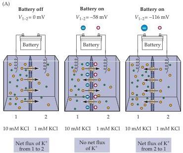
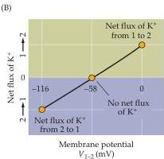

Chapter Two

Figure 2.5 Membrane potential influences ion fluxes.
(A) Connecting a battery across the  $\mathbf{K}^{+}$ -permeable membrane allows direct control of membrane potential.
When the battery is turned off (left),  $\mathbf{K}^{+}$ ions (yellow) flow simply according to their concentration gradient.
Setting the initial membrane potential  $(V_{1-2})$  at the equilibrium potential for  $\mathbf{K}^{+}$  (center) yields no net flux of  $\mathbf{K}^{+}$ , while making the membrane potential more negative than the  $\mathbf{K}^{+}$ equilibrium potential (right) causes  $\mathbf{K}^{+}$ to flow against its concentration gradient.
(B) Relationship between membrane potential and direction of  $\mathbf{K}^{+}$ flux.

tration gradient for an ion (see Figure 2.4C) provides convenient tools for studying ion fluxes across the plasma membranes of neurons, as will be evident in many of the experiments described in the following chapters.

# Electrochemical Equilibrium in an Environment with More Than One Permeant Ion

Now consider a somewhat more complex situation in which  $\mathrm{Na^{+}}$  and  $\mathrm{K}^+$  are unequally distributed across the membrane, as in Figure 2.6A.
What would happen if  $10\mathrm{mM}\mathrm{K}^{+}$  and  $1\mathrm{mM}\mathrm{Na}^{+}$  were present in compartment 1, and  $1\mathrm{mM}\mathrm{K}^{+}$  and  $10\mathrm{mM}\mathrm{Na}^{+}$  in compartment 2? If the membrane were permeable only to  $\mathrm{K}^{+}$ , the membrane potential would be  $-58\mathrm{mV}$ ; if the membrane were permeable only to  $\mathrm{Na}^{+}$ , the potential would be  $+58\mathrm{mV}$ .
But what would the potential be if the membrane were permeable to both  $\mathrm{K}^{+}$  and  $\mathrm{Na}^{+}$ ? In this case, the potential would depend on the relative permeability of the membrane to  $\mathrm{K}^{+}$  and  $\mathrm{Na}^{+}$ .
If it were more permeable to  $\mathrm{K}^{+}$ , the potential would approach  $-58\mathrm{mV}$ , and if it were more permeable to  $\mathrm{Na}^{+}$ , the potential would be closer to  $+58\mathrm{mV}$ .
Because there is no permeability term in the Nernst equation, which only considers the simple case of a single permeant ion species, a more elaborate equation is needed that takes into account both the concentration gradients of the permeant ions and the relative permeability of the membrane to each permeant species.

Such an equation was developed by David Goldman in 1943.
For the case most relevant to neurons, in which  $\mathrm{K}^{+}$ ,  $\mathrm{Na}^{+}$ , and  $\mathrm{Cl}^{-}$  are the primary permeant ions, the Goldman equation is written

$$
V = 5 8 \log \frac {P _ {\mathrm {K}} [ \mathrm {K} ] _ {2} + P _ {\mathrm {N a}} [ \mathrm {N a} ] _ {2} + P _ {\mathrm {C l}} [ \mathrm {C l} ] _ {1}}{P _ {\mathrm {K}} [ \mathrm {K} ] _ {1} + P _ {\mathrm {N a}} [ \mathrm {N a} ] _ {1} + P _ {\mathrm {C l}} [ \mathrm {C l} ] _ {2}}
$$

where  $V$  is the voltage across the membrane (again, compartment 1 relative to the reference compartment 2) and  $P$  indicates the permeability of the