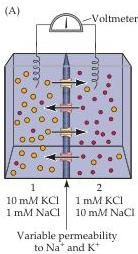
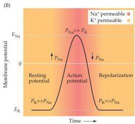

Electrical Signals of Nerve Cells 39

Figure 2.6 Resting and action potentials entail permeabilities to different ions.
(A) Hypothetical situation in which a membrane variably permeable to $\mathrm{Na^{+}}$ (red) and $\mathrm{K^{+}}$ (yellow) separates two compartments that contain both ions.
For simplicity, $\mathrm{Cl^-}$ ions are not shown in the diagram.
(B) Schematic representation of the membrane ionic permeabilities associated with resting and action potentials.
At rest, neuronal membranes are more permeable to $\mathrm{K^{+}}$ (yellow) than to $\mathrm{Na^{+}}$ (red); accordingly, the resting membrane potential is negative and approaches the equilibrium potential for $\mathrm{K^{+}}$, $E_{\mathrm{K}}$.
During an action potential, the membrane becomes very permeable to $\mathrm{Na^{+}}$ (red); thus the membrane potential becomes positive and approaches the equilibrium potential for $\mathrm{Na^{+}}$, $E_{\mathrm{Na}}$.
The rise in $\mathrm{Na^{+}}$ permeability is transient, however, so that the membrane again becomes primarily permeable to $\mathrm{K^{+}}$ (yellow), causing the potential to return to its negative resting value.
Notice that at the equilibrium potential for a given ion, there is no net flux of that ion across the membrane.

membrane to each ion of interest.
The Goldman equation is thus an extended version of the Nernst equation that takes into account the relative permeabilities of each of the ions involved.
The relationship between the two equations becomes obvious in the situation where the membrane is permeable only to one ion, say, $\mathrm{K}^{+}$; in this case, the Goldman expression collapses back to the simpler Nernst equation.
In this context, it is important to note that the valence factor (z) in the Nernst equation has been eliminated; this is why the concentrations of negatively charged chloride ions, $\mathrm{Cl}^{-}$, have been inverted relative to the concentrations of the positively charged ions [remember that $-\log (\mathrm{A} / \mathrm{B}) = \log (\mathrm{B} / \mathrm{A})$].

If the membrane in Figure 2.6A is permeable to $\mathrm{K}^{+}$ and $\mathrm{Na}^{+}$ only, the terms involving $\mathrm{Cl}^{-}$ drop out because $P_{\mathrm{Cl}}$ is 0.
In this case, solution of the Goldman equation yields a potential of $-58\mathrm{mV}$ when only $\mathrm{K}^{+}$ is permeant, $+58\mathrm{mV}$ when only $\mathrm{Na}^{+}$ is permeant, and some intermediate value if both ions are permeant.
For example, if $\mathrm{K}^{+}$ and $\mathrm{Na}^{+}$ were equally permeant, then the potential would be $0\mathrm{mV}$.

With respect to neural signaling, it is particularly pertinent to ask what would happen if the membrane started out being permeable to $\mathrm{K}^{+}$, and then temporarily switched to become most permeable to $\mathrm{Na}^{+}$.
In this circumstance, the membrane potential would start out at a negative level, become positive while the $\mathrm{Na}^{+}$ permeability remained high, and then fall back to a negative level as the $\mathrm{Na}^{+}$ permeability decreased again.
As it turns out, this last case essentially describes what goes on in a neuron during the generation of an action potential.
In the resting state, $P_{\mathrm{K}}$ of the neuronal plasma membrane is much higher than $P_{\mathrm{Na}}$; since, as a result of the action of ion transporters, there is always more $\mathrm{K}^{+}$ inside the cell than outside (Table 2.1), the resting potential is negative (Figure 2.6B).
As the membrane potential is depolarized (by synaptic action, for example), $P_{\mathrm{Na}}$ increases.
The transient increase in $\mathrm{Na}^{+}$ permeability causes the membrane potential to become even more positive (red region in Figure 2.6B), because $\mathrm{Na}^{+}$ rushes in (there is much more $\mathrm{Na}^{+}$ outside a neuron than inside, again as a result of ion pumps).
Because of this positive feedback loop, an action potential occurs.
The rise in $\mathrm{Na}^{+}$ permeability during the action potential is transient, however; as the membrane permeability to $\mathrm{K}^{+}$ is restored, the membrane potential quickly returns to its resting level.