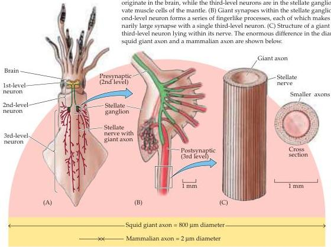

Electrical Signals of Nerve Cells 41

# Box A

## The Remarkable Giant Nerve Cells of Squid

Many of the initial insights into how ion concentration gradients and changes in membrane permeability produce electrical signals came from experiments performed on the extraordinarily large nerve cells of the squid.
The axons of these nerve cells can be up to 1 mm in diameter—100 to 1000 times larger than mammalian axons.
Thus, squid axons are large enough to allow experiments that would be impossible on most other nerve cells.
For example, it is not difficult to insert simple wire electrodes inside these giant axons and make reliable electrical measurements.
The relative ease of this approach yielded the first intracellular recordings of action potentials from nerve cells and, as discussed in the next chapter, the first experimental measurements of the ion currents that produce action potentials.
It also is practical to extrude the cytoplasm from giant axons and measure its ionic composition (see Table 2.1).
In addition, some giant nerve cells form synaptic contacts with other giant nerve cells, producing very large synapses that have been extraordinarily valuable in understanding the fundamental mechanisms of synaptic transmission (see Chapter 5).

Giant neurons evidently evolved in squid because they enhanced survival.
These neurons participate in a simple neural circuit that activates the contraction of the mantle muscle, producing a jet propulsion effect that allows the squid to move away from predators at a remarkably fast speed.
As discussed in Chapter 3, larger axonal diameter allows faster conduction of action potentials.
Thus, presumably these huge nerve cells help squid escape more successfully from their numerous enemies.

Today—nearly 70 years after their discovery by John Z.
Young at University College London—the giant nerve cells of squid remain useful experimental systems for probing basic neuronal functions.

## References

LLINAS, R.
(1999) *The Squid Synapse: A Model for Chemical Transmission*.
Oxford: Oxford University Press.

YOUNG, J.
Z.
(1939) Fused neurons and synaptic contacts in the giant nerve fibres of cephalopods.
Phil.
Trans.
R.
Soc.
Lond.
229(B): 465–503.

(A) Diagram of a squid, showing the location of its giant nerve cells.
Different colors indicate the neuronal components of the escape circuitry.
The first- and second-level neurons originate in the brain, while the third-level neurons are in the stellate ganglion and innervate muscle cells of the mantle.
(B) Giant synapses within the stellate ganglion.
The second-level neuron forms a series of fingerlike processes, each of which makes an extraordinarily large synapse with a single third-level neuron.
(C) Structure of a giant axon of a third-level neuron lying within its nerve.
The enormous difference in the diameters of a squid giant axon and a mammalian axon are shown below.

