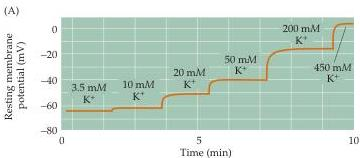
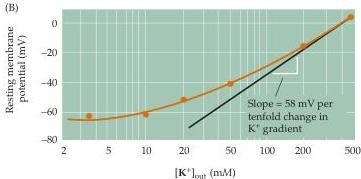

Chapter Two

Figure 2.7 Experimental evidence that the resting membrane potential of a squid giant axon is determined by the  $\mathbf{K}^{+}$  concentration gradient across the membrane.
(A) Increasing the external  $\mathbf{K}^{+}$  concentration makes the resting membrane potential more positive.
(B) Relationship between resting membrane potential and external  $\mathbf{K}^{+}$  concentration, plotted on a semi-logarithmic scale.
The straight line represents a slope of  $58\mathrm{mV}$  per tenfold change in concentration, as given by the Nernst equation.
(After Hodgkin and Katz, 1949.)

When Hodgkin and Katz carried out this experiment on a living squid neuron, they found that the resting membrane potential did indeed change when the external  $\mathrm{K}^+$  concentration was modified, becoming less negative as external  $\mathrm{K}^+$  concentration was raised (Figure 2.7A).
When the external  $\mathrm{K}^+$  concentration was raised high enough to equal the concentration of  $\mathrm{K}^+$  inside the neuron, thus making the  $\mathrm{K}^+$  equilibrium potential  $0\mathrm{mV}$ , the resting membrane potential was also approximately  $0\mathrm{mV}$ .
In short, the resting membrane potential varied as predicted with the logarithm of the  $\mathrm{K}^+$  concentration, with a slope that approached  $58\mathrm{mV}$  per tenfold change in  $\mathrm{K}^+$  concentration (Figure 2.7B).
The value obtained was not exactly  $58\mathrm{mV}$  because other ions, such as  $\mathrm{Cl}^-$  and  $\mathrm{Na}^+$ , are also slightly permeable, and thus influence the resting potential to a small degree.
The contribution of these other ions is particularly evident at low external  $\mathrm{K}^+$  levels, again as predicted by the Goldman equation.
In general, however, manipulation of the external concentrations of these other ions has only a small effect, emphasizing that  $\mathrm{K}^+$  permeability is indeed the primary source of the resting membrane potential.

In summary, Hodgkin and Katz showed that the inside-negative resting potential arises because (1) the membrane of the resting neuron is more permeable to  $\mathbf{K}^{+}$  than to any of the other ions present, and (2) there is more  $\mathbf{K}^{+}$  inside the neuron than outside.
The selective permeability to  $\mathbf{K}^{+}$  is caused by  $\mathbf{K}^{+}$ -permeable membrane channels that are open in resting neurons, and the