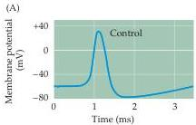
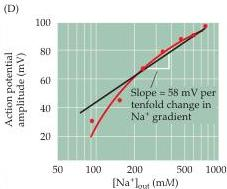
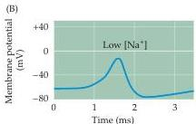
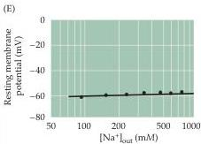
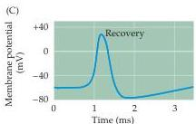

Electrical Signals of Nerve Cells 43

large $\mathrm{K}^+$ concentration gradient is, as noted, produced by membrane transporters that selectively accumulate $\mathrm{K}^+$ within neurons.
Many subsequent studies have confirmed the general validity of these principles.

## The Ionic Basis of Action Potentials

What causes the membrane potential of a neuron to depolarize during an action potential? Although a general answer to this question has been given (increased permeability to $\mathrm{Na}^+$), it is well worth examining some of the experimental support for this concept.
Given the data presented in Table 2.1, one can use the Nernst equation to calculate that the equilibrium potential for $\mathrm{Na}^+$ ($E_{\mathrm{Na}}$) in neurons, and indeed in most cells, is positive.
Thus, if the membrane were to become highly permeable to $\mathrm{Na}^+$, the membrane potential would approach $E_{\mathrm{Na}}$.
Based on these considerations, Hodgkin and Katz hypothesized that the action potential arises because the neuronal membrane becomes temporarily permeable to $\mathrm{Na}^+$.

Taking advantage of the same style of ion substitution experiment they used to assess the resting potential, Hodgkin and Katz tested the role of $\mathrm{Na}^+$ in generating the action potential by asking what happens to the action potential when $\mathrm{Na}^+$ is removed from the external medium.
They found that lowering the external $\mathrm{Na}^+$ concentration reduces both the rate of rise of the action potential and its peak amplitude (Figure 2.8A–C).
Indeed, when they examined this $\mathrm{Na}^+$ dependence quantitatively, they found a more-or-less linear relationship between the amplitude of the action potential and the logarithm of the external $\mathrm{Na}^+$ concentration (Figure 2.8D).
The slope of this relationship

Figure 2.8 The role of sodium in the generation of an action potential in a squid giant axon.
(A) An action potential evoked with the normal ion concentrations inside and outside the cell.
(B) The amplitude and rate of rise of the action potential diminish when external sodium concentration is reduced to one-third of normal, but (C) recover when the $\mathrm{Na}^+$ is replaced.
(D) While the amplitude of the action potential is quite sensitive to the external concentration of $\mathrm{Na}^+$, the resting membrane potential (E) is little affected by changing the concentration of this ion.
(After Hodgkin and Katz, 1949.)