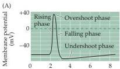
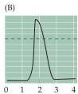
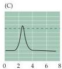
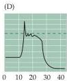
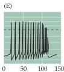

Chapter Two

# Box B

## Action Potential Form and Nomenclature

The action potential of the squid giant axon has a characteristic shape, or waveform, with a number of different phases (Figure A).
During the rising phase, the membrane potential rapidly depolarizes.
In fact, action potentials cause the membrane potential to depolarize so much that the membrane potential transiently becomes positive with respect to the external medium, producing an overshoot.
The overshoot of the action potential gives way to a falling phase in which the membrane potential rapidly repolarizes.
Repolarization takes the membrane potential to levels even more negative than the resting membrane potential for a short time; this brief period of hyperpolarization is called the undershoot.

Although the waveform of the squid action potential is typical, the details of the action potential form vary widely from neuron to neuron in different animals.
In myelinated axons of vertebrate motor neurons (Figure B), the action potential is virtually indistinguishable from that of the squid axon.
However, the action potential recorded in the cell body of this same motor neuron (Figure C) looks rather different.
Thus, the action potential waveform can vary even within the same neuron.
More complex action potentials are seen in other central neurons.
For example, action potentials recorded from the cell bodies of neurons in the mammalian inferior olive (a region of the brainstem involved in motor control) last tens of milliseconds (Figure D).
These action potentials exhibit a pronounced plateau during their falling phase, and their undershoot lasts even longer than that of the motor neuron.
One of the most dramatic types of action potentials occurs in the cell bodies of cerebellar Purkinje neurons (Figure E).
These potentials have several complex phases that result from the summation of multiple, discrete action potentials.

The variety of action potential waveforms could mean that each type of neuron has a different mechanism of action potential production.
Fortunately, however, these diverse waveforms all result from relatively minor variations in the scheme used by the squid giant axon.
For example, plateaus in the repolarization phase result from the presence of ion channels that are permeable to $\mathrm{Ca^{2+}}$, and long-lasting undershoots result from the presence of additional types of membrane $\mathrm{K}^+$ channels.
The complex action potential of the Purkinje cell results from these extra features plus the fact that different types of action potentials are generated in various parts of the Purkinje neuron—cell body, dendrites, and axons—and are summed together in recordings from the cell body.
Thus, the lessons learned from the squid axon are applicable to, and indeed essential for, understanding action potential generation in all neurons.

## References

BARRETT, E.
F.
AND J.
N.
BARRETT (1976) Separation of two voltage-sensitive potassium currents, and demonstration of a tetrodotoxin-resistant calcium current in frog motoneurones.
J.
Physiol.
(Lond.) 255: 737-774.

DODGE, F.
A.
AND B.
FRANKENHAFUSER (1958) Membrane currents in isolated frog nerve fibre under voltage clamp conditions.
J.
Physiol.
(Lond.) 143: 76-90.

HODGKIN, A.
L.
AND A.
F.
HUXLEY (1939) Action potentials recorded from inside a nerve fibre.
Nature 144: 710-711.

LLINÁS, R.
AND M.
SUGIMORI (1980) Electrophysiological properties of in vitro Purkinje cell dendrites in mammalian cerebellar slices.
J.
Physiol.
(Lond.) 305: 197-213.

LLINÁS, R.
AND Y.
YAROM (1981) Electrophysiology of mammalian inferior olivary neurones in vitro.
Different types of voltage-dependent ionic conductances.
J.
Physiol.
(Lond.) 315: 549-567.

(A) The phases of an action potential of the squid giant axon.
(B) Action potential recorded from a myelinated axon of a frog motor neuron.
(C) Action potential recorded from the cell body of a frog motor neuron.
The action potential is smaller and the undershoot prolonged in comparison to the action potential recorded from the axon of this same neuron (B).
(D) Action potential recorded from the cell body of a neuron from the inferior olive of a guinea pig.
This action potential has a pronounced plateau during its falling phase.
(E) Action potential recorded from the cell body of a Purkinje neuron in the cerebellum of a guinea pig.
(A after Hodgkin and Huxley, 1939; B after Dodge and Frankenhaeuser, 1958; C after Barrett and Barrett, 1976; D after Llinás and Yarom, 1981; E after Llinás and Sugimori, 1980.)

Time (ms)

