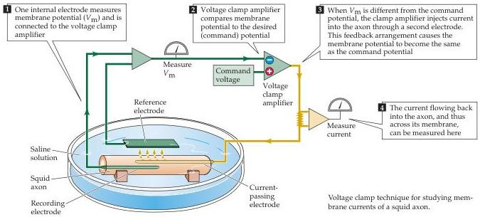

Chapter Three

# Box A

## The Voltage Clamp Method

Breakthroughs in scientific research often rely on the development of new technologies.
In the case of the action potential, detailed understanding came only after the invention of the voltage clamp technique by Kenneth Cole in the 1940s.
This device is called a voltage clamp because it controls, or clamps, membrane potential (or voltage) at any level desired by the experimenter.
The method measures the membrane potential with a microelectrode (or other type of electrode) placed inside the cell (1), and electronically compares this voltage to the voltage to be maintained (called the command voltage) (2).
The clamp circuitry then passes a current back into the cell though another intracellular electrode (3).
This electronic feedback circuit holds the membrane potential at the desired level, even in the face of permeability changes that would normally alter the membrane potential (such as those generated during the action potential).
Most importantly, the device permits the simultaneous measurement of the current needed to keep the cell at a given voltage (4).
This current is exactly equal to the amount of current flowing across the neuronal membrane, allowing direct measurement of these membrane currents.
Therefore, the voltage clamp technique can indicate how membrane potential influences ionic current flow across the membrane.
This information gave Hodgkin and Huxley the key insights that led to their model for action potential generation.

Today, the voltage clamp method remains widely used to study ionic currents in neurons and other cells.
The most popular contemporary version of this approach is the patch clamp technique, a method that can be applied to virtually any cell and has a resolution high enough to measure the minute electrical currents flowing through single ion channels (see Box A in Chapter 4).

## References

COLE, K.
S.
(1968) Membranes, Ions and Impulses: A Chapter of Classical Biophysics.
Berkeley, CA: University of California Press.

potential to study the permeability change, because such changes in membrane potential will produce an action potential, which causes further, uncontrolled changes in the membrane potential.
Historically, then, it was not really possible to understand action potentials until a technique was developed that allowed experimenters to control membrane potential and simultaneously measure the underlying permeability changes.
This tech