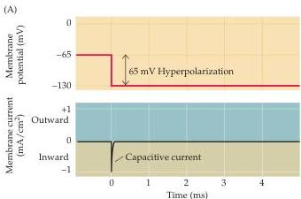
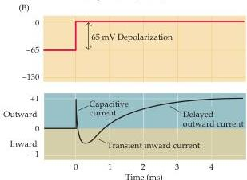

Voltage-Dependent Membrane Permeability

nique, the voltage clamp method (Box A), provides the information needed to define the ionic permeability of the membrane at any level of membrane potential.

In the late 1940s, Alan Hodgkin and Andrew Huxley working at the University of Cambridge used the voltage clamp technique to work out the permeability changes underlying the action potential.
They again chose to use the giant neuron of the squid because its large size (up to  $1\mathrm{mm}$  in diameter; see Box A in Chapter 2) allowed insertion of the electrodes necessary for voltage clamping.
They were the first investigators to test directly the hypothesis that potential-sensitive  $\mathrm{Na^{+}}$  and  $\mathbf{K}^+$  permeability changes are both necessary and sufficient for the production of action potentials.

Hodgkin and Huxley's first goal was to determine whether neuronal membranes do, in fact, have voltage-dependent permeabilities.
To address this issue, they asked whether ionic currents flow across the membrane when its potential is changed.
The result of one such experiment is shown in Figure 3.1.
Figure 3.1A illustrates the currents produced by a squid axon when its membrane potential,  $V_{\mathrm{m}}$ , is hyperpolarized from the resting level of  $-65\mathrm{mV}$  to  $-130\mathrm{mV}$ .
The initial response of the axon results from the redistribution of charge across the axonal membrane.
This capacitive current is nearly instantaneous, ending within a fraction of a millisecond.
Aside from this brief event, very little current flows when the membrane is hyperpolarized.
However, when the membrane potential is depolarized from  $-65\mathrm{mV}$  to  $0\mathrm{mV}$ , the response is quite different (Figure 3.1B).
Following the capacitive current, the axon produces a rapidly rising inward ionic current (inward refers to a positive charge entering the cell—that is, cations in or anions out), which gives way to a more slowly rising, delayed outward current.
The fact that membrane depolarization elicits these ionic currents establishes that the membrane permeability of axons is indeed voltage-dependent.

# Two Types of Voltage-Dependent Ionic Current

The results shown in Figure 3.1 demonstrate that the ionic permeability of neuronal membranes is voltage-sensitive, but the experiments do not identify how many types of permeability exist, or which ions are involved.
As discussed in Chapter 2 (see Figure 2.5), varying the potential across a membrane makes it possible to deduce the equilibrium potential for the ionic fluxes through the membrane, and thus to identify the ions that are flowing.

Figure 3.1 Current flow across a squid axon membrane during a voltage clamp experiment.
(A) A  $65\mathrm{mV}$  hyperpolarization of the membrane potential produces only a very brief capacitive current.
(B) A  $65\mathrm{mV}$  depolarization of the membrane potential also produces a brief capacitive current, which is followed by a longer lasting but transient phase of inward current and a delayed but sustained outward current.
(After Hodgkin et al., 1952.)

