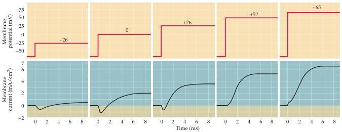
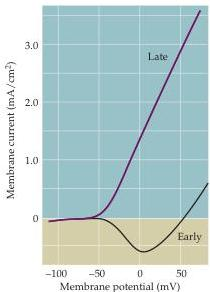

Chapter Three

Figure 3.2 Current produced by membrane depolarizations to several different potentials.
The early current first increases, then decreases in magnitude as the depolarization increases; note that this current is actually reversed in polarity at potentials more positive than about  $+55\mathrm{mV}$ .
In contrast, the late current increases monotonically with increasing depolarization.
(After Hodgkin et al., 1952.)

Figure 3.3 Relationship between current amplitude and membrane potential, taken from experiments such as the one shown in Figure 3.2.
Whereas the late outward current increases steeply with increasing depolarization, the early inward current first increases in magnitude, but then decreases and reverses to outward current at about  $+55\mathrm{mV}$  (the sodium equilibrium potential).
(After Hodgkin et al., 1952.)

Because the voltage clamp method allows the membrane potential to be changed while ionic currents are being measured, it was a straightforward matter for Hodgkin and Huxley to determine ionic permeability by examining how the properties of the early inward and late outward currents changed as the membrane potential was varied (Figure 3.2).
As already noted, no appreciable ionic currents flow at membrane potentials more negative than the resting potential.
At more positive potentials, however, the currents not only flow but change in magnitude.
The early current has a U-shaped dependence on membrane potential, increasing over a range of depolarizations up to approximately  $0\mathrm{mV}$  but decreasing as the potential is depolarized further.
In contrast, the late current increases monotonically with increasingly positive membrane potentials.
These different responses to membrane potential can be seen more clearly when the magnitudes of the two current components are plotted as a function of membrane potential, as in Figure 3.3.

The voltage sensitivity of the early inward current gives an important clue about the nature of the ions carrying the current, namely, that no current flows when the membrane potential is clamped at  $+52\mathrm{mV}$ .
For the squid neurons studied by Hodgkin and Huxley, the external  $\mathrm{Na^{+}}$ concentration is  $440~\mathrm{mM}$ , and the internal  $\mathrm{Na^{+}}$ concentration is  $50~\mathrm{mM}$ .
For this concentration gradient, the Nernst equation predicts that the equilibrium poten