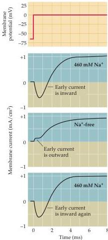

Voltage-Dependent Membrane Permeability

tial for  $\mathrm{Na^{+}}$  should be  $+55\mathrm{mV}$ .
Recall further from Chapter 2 that at the  $\mathrm{Na^{+}}$  equilibrium potential there is no net flux of  $\mathrm{Na^{+}}$  across the membrane, even if the membrane is highly permeable to  $\mathrm{Na^{+}}$ .
Thus, the experimental observation that no current flows at the membrane potential where  $\mathrm{Na^{+}}$  cannot flow is a strong indication that the early inward current is carried by entry of  $\mathrm{Na^{+}}$  into the axon.

An even more demanding way to test whether  $\mathrm{Na^{+}}$  carries the early inward current is to examine the behavior of this current after removing external  $\mathrm{Na^{+}}$ .
Removing the  $\mathrm{Na^{+}}$  outside the axon makes  $E_{\mathrm{Na}}$  negative; if the permeability to  $\mathrm{Na^{+}}$  is increased under these conditions, current should flow outward as  $\mathrm{Na^{+}}$  leaves the neuron, due to the reversed electrochemical gradient.
When Hodgkin and Huxley performed this experiment, they obtained the result shown in Figure 3.4.
Removing external  $\mathrm{Na^{+}}$  caused the early inward current to reverse its polarity and become an outward current at a membrane potential that gave rise to an inward current when external  $\mathrm{Na^{+}}$  was present.
This result demonstrates convincingly that the early inward current measured when  $\mathrm{Na^{+}}$  is present in the external medium must be due to  $\mathrm{Na^{+}}$  entering the neuron.

Notice that removal of external  $\mathrm{Na^{+}}$  in the experiment shown in Figure 3.4 has little effect on the outward current that flows after the neuron has been kept at a depolarized membrane voltage for several milliseconds.
This further result shows that the late outward current must be due to the flow of an ion other than  $\mathrm{Na^{+}}$ .
Several lines of evidence presented by Hodgkin, Huxley, and others showed that this late outward current is caused by  $\mathrm{K^{+}}$  exiting the neuron.
Perhaps the most compelling demonstration of  $\mathrm{K^{+}}$  involvement is that the amount of  $\mathrm{K^{+}}$  efflux from the neuron, measured by loading the neuron with radioactive  $\mathrm{K^{+}}$ , is closely correlated with the magnitude of the late outward current.

Taken together, these experiments using the voltage clamp show that changing the membrane potential to a level more positive than the resting potential produces two effects: an early influx of  $\mathrm{Na^{+}}$  into the neuron, followed by a delayed efflux of  $\mathrm{K^{+}}$ .
The early influx of  $\mathrm{Na^{+}}$  produces a transient inward current, whereas the delayed efflux of  $\mathrm{K^{+}}$  produces a sustained outward current.
The differences in the time course and ionic selectivity of the two fluxes suggest that two different ionic permeability mechanisms are activated by changes in membrane potential.
Confirmation that there are indeed two distinct mechanisms has come from pharmacological studies of drugs that specifically affect these two currents (Figure 3.5).
Tetrodotoxin, an alkaloid neurotoxin found in certain puffer fish, tropical frogs, and salamanders, blocks the  $\mathrm{Na^{+}}$  current without affecting the  $\mathrm{K^{+}}$  current.
Conversely, tetraethylammonium ions block  $\mathrm{K^{+}}$  currents without affecting  $\mathrm{Na^{+}}$  currents.
The differential sensitivity of  $\mathrm{Na^{+}}$  and  $\mathrm{K^{+}}$  currents to these drugs provides strong additional evidence that  $\mathrm{Na^{+}}$  and  $\mathrm{K^{+}}$  flow through independent permeability pathways.
As discussed in Chapter 4, it is now known that these pathways are ion channels that are selectively permeable to either  $\mathrm{Na^{+}}$  or  $\mathrm{K^{+}}$ .
In fact, tetrodotoxin, tetraethylammonium, and other drugs that interact with spe

Figure 3.4 Dependence of the early inward current on sodium.
In the presence of normal external concentrations of  $\mathrm{Na^{+}}$ , depolarization of a squid axon to  $0\mathrm{mV}$  produces an inward initial current.
However, removal of external  $\mathrm{Na^{+}}$  causes the initial inward current to become outward, an effect that is reversed by restoration of external  $\mathrm{Na^{+}}$ .
(After Hodgkin and Huxley, 1952a.)