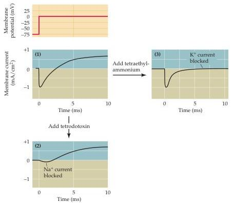

Chapter Three

Figure 3.5 Pharmacological separation of  $\mathrm{Na^{+}}$  and  $\mathbf{K}^+$  currents into sodium and potassium components.
Panel (1) shows the current that flows when the membrane potential of a squid axon is depolarized to  $0\mathrm{mV}$  in control conditions.
(2) Treatment with tetrodotoxin causes the early  $\mathrm{Na^{+}}$  currents to disappear but spares the late  $\mathbf{K}^+$  currents.
(3) Addition of tetraethylammonium blocks the  $\mathbf{K}^+$  currents without affecting the  $\mathrm{Na^{+}}$  currents.
(After Moore et al., 1967 and Armstrong and Binstock, 1965.)

cific types of ion channels have been extraordinarily useful tools in characterizing these channel molecules (see Chapter 4).

# Two Voltage-Dependent Membrane Conductances

The next goal Hodgkin and Huxley set for themselves was to describe  $\mathrm{Na^{+}}$  and  $\mathbf{K}^+$  permeability changes mathematically.
To do this, they assumed that the ionic currents are due to a change in membrane conductance, defined as the reciprocal of the membrane resistance.
Membrane conductance is thus closely related, although not identical, to membrane permeability.
When evaluating ionic movements from an electrical standpoint, it is convenient to describe them in terms of ionic conductances rather than ionic permeabilities.
For present purposes, permeability and conductance can be considered synonymous.
If membrane conductance  $(g)$  obeys Ohm's Law (which states that voltage is equal to the product of current and resistance), then the ionic current that flows during an increase in membrane conductance is given by

$$
I _ {\text {i o n}} = g _ {\text {i o n}} \left(V _ {\mathrm {m}} - E _ {\text {i o n}}\right)
$$

where  $I_{\mathrm{ion}}$  is the ionic current,  $V_{\mathrm{m}}$  is the membrane potential, and  $E_{\mathrm{ion}}$  is the equilibrium potential for the ion flowing through the conductance,  $g_{\mathrm{ion}}$ .
The difference between  $V_{\mathrm{m}}$  and  $E_{\mathrm{ion}}$  is the electrochemical driving force acting on the ion.

Hodgkin and Huxley used this simple relationship to calculate the dependence of  $\mathrm{Na^{+}}$  and  $\mathbf{K}^+$  conductances on time and membrane potential.
They knew  $V_{\mathrm{m}}$ , which was set by their voltage clamp device (Figure 3.6A), and could determine  $E_{\mathrm{Na}}$  and  $E_{\mathrm{K}}$  from the ionic concentrations on the two sides