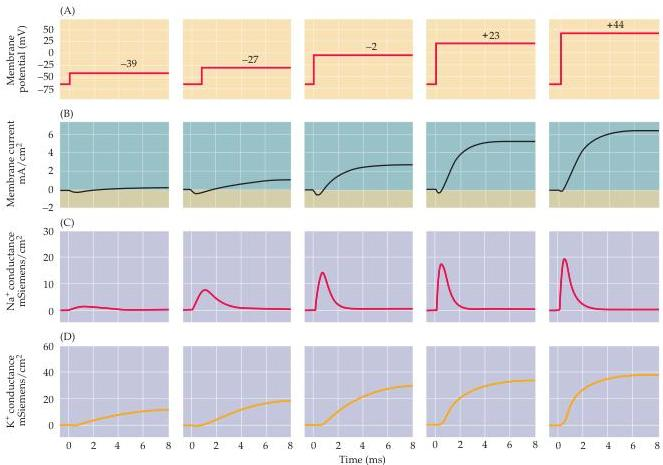

Voltage-Dependent Membrane Permeability

Figure 3.6 Membrane conductance changes underlying the action potential are time- and voltage-dependent.
Depolarizations to various membrane potentials (A) elicit different membrane currents (B).
Below are shown the  $\mathrm{Na^{+}}$  (C) and  $\mathrm{K^{+}}$  (D) conductances calculated from these currents.
Both peak  $\mathrm{Na^{+}}$  conductance and steady-state  $\mathrm{K^{+}}$  conductance increase as the membrane potential becomes more positive.
In addition, the activation of both conductances, as well as the rate of inactivation of the  $\mathrm{Na^{+}}$  conductance, occur more rapidly with larger depolarizations.
(After Hodgkin and Huxley, 1952b.)

of the axonal membrane (see Table 2.1).
The currents carried by  $\mathrm{Na^{+}}$  and  $\mathrm{K^{+}} - I_{\mathrm{Na}}$  and  $I_{\mathrm{K}}$  could be determined separately from recordings of the membrane currents resulting from depolarization (Figure 3.6B) by measuring the difference between currents recorded in the presence and absence of external  $\mathrm{Na^{+}}$  (as shown in Figure 3.4).
From these measurements, Hodgkin and Huxley were able to calculate  $g_{\mathrm{Na}}$  and  $g_{\mathrm{K}}$  (Figure 3.6C,D), from which they drew two fundamental conclusions.
The first conclusion is that the  $\mathrm{Na^{+}}$  and  $\mathrm{K^{+}}$  conductances change over time.
For example, both  $\mathrm{Na^{+}}$  and  $\mathrm{K^{+}}$  conductances require some time to activate, or turn on.
In particular, the  $\mathrm{K^{+}}$  conductance has a pronounced delay, requiring several milliseconds to reach its maximum (Figure 3.6D), whereas the  $\mathrm{Na^{+}}$  conductance reaches its maximum more rapidly (Figure 3.6C).
The more rapid activation of the  $\mathrm{Na^{+}}$  conductance allows the resulting inward  $\mathrm{Na^{+}}$  current to precede the delayed outward  $\mathrm{K^{+}}$  current (see Figure 3.6B).
Although the  $\mathrm{Na^{+}}$  conductance rises rapidly, it quickly declines, even though the membrane potential is kept at a depolarized level.
This fact shows that depolarization not only causes the  $\mathrm{Na^{+}}$  conductance to activate, but also causes it to decrease over time, or inactivate.
The  $\mathrm{K^{+}}$  conductance of the squid axon does not inactivate in this way; thus, while the  $\mathrm{Na^{+}}$  and  $\mathrm{K^{+}}$  conductances share the property of time-dependent activation, only the  $\mathrm{Na^{+}}$  conductance inactivates.
(Inactivating  $\mathrm{K^{+}}$  conductances have since been discovered in other types of nerve cells; see Chapter 4.) The time courses of the  $\mathrm{Na^{+}}$  and  $\mathrm{K^{+}}$  conductances are voltage-