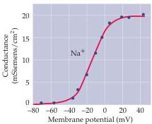
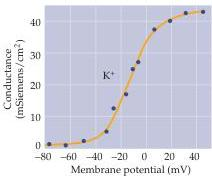

Chapter Three

Figure 3.7 Depolarization increases  $\mathrm{Na^{+}}$  and  $\mathbf{K}^+$  conductances of the squid giant axon.
The peak magnitude of  $\mathrm{Na^{+}}$  conductance and steady-state value of  $\mathbf{K}^+$  conductance both increase steeply as the membrane potential is depolarized.
(After Hodgkin and Huxley, 1952b.)

dependent, with the speed of both activation and inactivation increasing at more depolarized potentials.
This finding accounts for more rapid time courses of membrane currents measured at more depolarized potentials.

The second conclusion derived from Hodgkin and Huxley's calculations is that both the  $\mathrm{Na^{+}}$  and  $\mathrm{K}^+$  conductances are voltage-dependent—that is, both conductances increase progressively as the neuron is depolarized.
Figure 3.7 illustrates this by plotting the relationship between peak value of the conductances (from Figure 3.6C,D) against the membrane potential.
Note the similar voltage dependence for each conductance; both conductances are quite small at negative potentials, maximal at very positive potentials, and exquisitely dependent on membrane voltage at intermediate potentials.
The observation that these conductances are sensitive to changes in membrane potential shows that the mechanism underlying the conductances somehow "senses" the voltage across the membrane.

All told, the voltage clamp experiments carried out by Hodgkin and Huxley showed that the ionic currents that flow when the neuronal membrane is depolarized are due to three different voltage-sensitive processes: (1) activation of  $\mathrm{Na^{+}}$  conductance, (2) activation of  $\mathrm{K}^+$  conductance, and (3) inactivation of  $\mathrm{Na^{+}}$  conductance.

# Reconstruction of the Action Potential

From their experimental measurements, Hodgkin and Huxley were able to construct a detailed mathematical model of the  $\mathrm{Na^{+}}$  and  $\mathrm{K}^+$  conductance changes.
The goal of these modeling efforts was to determine whether the  $\mathrm{Na^{+}}$  and  $\mathrm{K}^+$  conductances alone are sufficient to produce an action potential.
Using this information, they could in fact generate the form and time course of the action potential with remarkable accuracy (Figure 3.8A).
Further, the Hodgkin-Huxley model predicted other features of action potential behavior in the squid axon, such as how the delay before action potential generation changes in response to stimulating currents of different intensities (Figure 3.8B,C).
The model also predicted that the axon membrane would become refractory to further excitation for a brief period following an action potential, as was experimentally observed.

The Hodgkin-Huxley model also provided many insights into how action potentials are generated.
Figure 3.8A shows a reconstructed action potential, together with the time courses of the underlying  $\mathrm{Na^{+}}$  and  $\mathrm{K}^+$  conductances.
The coincidence of the initial increase in  $\mathrm{Na^{+}}$  conductance with the rapid rising phase of the action potential demonstrates that a selective increase in