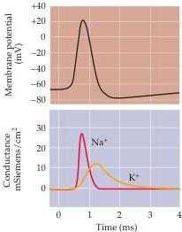
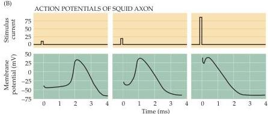
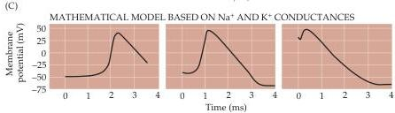

Voltage-Dependent Membrane Permeability

(A)

Figure 3.8 Mathematical reconstruction of the action potential.
(A) Reconstruction of an action potential (black curve) together with the underlying changes in  $\mathrm{Na^{+}}$  (red curve) and  $\mathbf{K}^+$  (yellow curve) conductance.
The size and time course of the action potential were calculated using only the properties of  $g_{\mathrm{Na}}$  and  $g_{\mathrm{K}}$  measured in voltage clamp experiments.
Real action potentials evoked by brief current pulses of different intensities (B) are remarkably similar to those generated by the mathematical model (C).
The reconstructed action potentials shown in (A) and (C) differ in duration because (A) simulates an action potential at  $19^{\circ}\mathrm{C}$ , whereas (C) simulates an action potential at  $6^{\circ}\mathrm{C}$ .
(After Hodgkin and Huxley, 1952d.)

$\mathrm{Na^{+}}$  conductance is responsible for action potential initiation.
The increase in  $\mathrm{Na^{+}}$  conductance causes  $\mathrm{Na^{+}}$  to enter the neuron, thus depolarizing the membrane potential, which approaches  $E_{\mathrm{Na}}$ .
The rate of depolarization subsequently falls both because the electrochemical driving force on  $\mathrm{Na^{+}}$  decreases and because the  $\mathrm{Na^{+}}$  conductance inactivates.
At the same time, depolarization slowly activates the voltage-dependent  $\mathrm{K^{+}}$  conductance, causing  $\mathrm{K^{+}}$  to leave the cell and repolarizing the membrane potential toward  $E_{\mathrm{K}}$ .
Because the  $\mathrm{K^{+}}$  conductance becomes temporarily higher than it is in the resting condition, the membrane potential actually becomes briefly more negative than the normal resting potential (the undershoot).
The hyperpolarization of the membrane potential causes the voltage-dependent  $\mathrm{K^{+}}$  conductance (and any  $\mathrm{Na^{+}}$  conductance not inactivated) to turn off, allowing the membrane potential to return to its resting level.