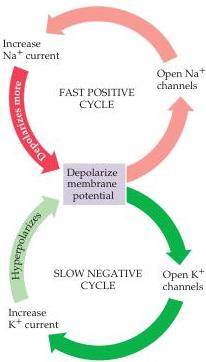

Chapter Three

Figure 3.9 Feedback cycles responsible for membrane potential changes during an action potential.
Membrane depolarization rapidly activates a positive feedback cycle fueled by the voltage-dependent activation of  $\mathrm{Na^{+}}$  conductance.
This phenomenon is followed by the slower activation of a negative feedback loop as depolarization activates a  $\mathrm{K}^+$  conductance, which helps to repolarize the membrane potential and terminate the action potential.

This mechanism of action potential generation represents a positive feedback loop: Activating the voltage-dependent  $\mathrm{Na^{+}}$  conductance increases  $\mathrm{Na^{+}}$  entry into the neuron, which makes the membrane potential depolarize, which leads to the activation of still more  $\mathrm{Na^{+}}$  conductance, more  $\mathrm{Na^{+}}$  entry, and still further depolarization (Figure 3.9).
Positive feedback continues unabated until  $\mathrm{Na^{+}}$  conductance inactivation and  $\mathrm{K^{+}}$  conductance activation restore the membrane potential to the resting level.
Because this positive feedback loop, once initiated, is sustained by the intrinsic properties of the neuron—namely, the voltage dependence of the ionic conductances—the action potential is self-supporting, or regenerative.
This regenerative quality explains why action potentials exhibit all-or-none behavior (see Figure 2.1), and why they have a threshold (Box B).
The delayed activation of the  $\mathrm{K^{+}}$  conductance represents a negative feedback loop that eventually restores the membrane to its resting state.

Hodgkin and Huxley's reconstruction of the action potential and all its features shows that the properties of the voltage-sensitive  $\mathrm{Na^{+}}$  and  $\mathrm{K^{+}}$  conductances, together with the electrochemical driving forces created by ion transporters, are sufficient to explain action potentials.
Their use of both empirical and theoretical methods brought an unprecedented level of rigor to a long-standing problem, setting a standard of proof that is achieved only rarely in biological research.

# Long-Distance Signaling by Means of Action Potentials

The voltage-dependent mechanisms of action potential generation also explain the long-distance transmission of these electrical signals.
Recall from Chapter 2 that neurons are relatively poor conductors of electricity, at least compared to a wire.
Current conduction by wires, and by neurons in the absence of action potentials, is called passive current flow (Box C).
The passive electrical properties of a nerve cell axon can be determined by measuring the voltage change resulting from a current pulse passed across the axonal membrane (Figure 3.10A).
If this current pulse is not large enough to generate action potentials, the magnitude of the resulting potential change decays exponentially with increasing distance from the site of current injection (Figure 3.10B).
Typically, the potential falls to a small fraction of its initial value at a distance of no more than a couple of millimeters away from the site of injection (Figure 3.10C).
The progressive decrease in the amplitude of the induced potential change occurs because the injected current leaks out across the axonal membrane; accordingly, less current is available to change the membrane potential farther along the axon.
Thus, the leakiness of the axonal membrane prevents effective passive transmission of electrical signals in all but the shortest axons (those  $1\mathrm{mm}$  or less in length).
Likewise, the leakiness of the membrane slows the time course of the responses measured at increasing distances from the site where current was injected (Figure 3.10D).