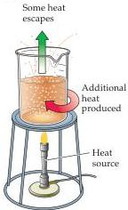
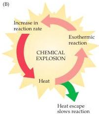
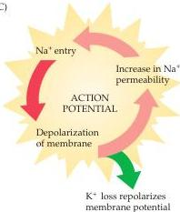

Voltage-Dependent Membrane Permeability

# Box B

# Threshold

An important—and potentially puzzling—property of the action potential is its initiation at a particular membrane potential, called threshold.
Indeed, action potentials never occur without a depolarizing stimulus that brings the membrane to this level.
The depolarizing "trigger" can be one of several events: a synaptic input, a receptor potential generated by specialized receptor organs, the endogenous pacemaker activity of cells that generate action potentials spontaneously, or the local current that mediates the spread of the action potential down the axon.

Why the action potential "takes off" at a particular level of depolarization can be understood by comparing the underlying events to a chemical explosion (Figure A).
Exogenous heat (analogous to the initial depolarization of the membrane potential) stimulates an exothermic chemical reaction, which produces more heat, which further enhances the reaction (Figure B).
As a result of this positive feedback loop, the rate of the reaction builds up exponentially—the definition of an explosion.
In any such

process, however, there is a threshold, that is, a point up to which heat can be supplied without resulting in an explosion.
The threshold for the chemical explosion diagrammed here is the point at which the amount of heat supplied exogenously is just equal to the amount of heat that can be dissipated by the circumstances of the reaction (such as escape of heat from the beaker).

The threshold of action potential initiation is, in principle, similar (Figure C).
There is a range of "subthreshold" depolarization, within which the rate of increased sodium entry is less than the rate of potassium exit (remember that the membrane at rest is highly permeable to  $\mathrm{K}^+$ , which therefore flows out as the membrane is depolarized).
The point at which  $\mathrm{Na}^+$  inflow just equals  $\mathrm{K}^+$  outflow represents an unstable equilibrium analogous to the ignition point of an explosive mixture.
The behavior of the membrane at threshold reflects this instability: The membrane potential may linger at the threshold level for a variable period before either returning to the resting level or flaring up into a full-blown

action potential.
In theory at least, if there is a net internal gain of a single  $\mathrm{Na^{+}}$  ion, an action potential occurs; conversely, the net loss of a single  $\mathrm{K^{+}}$  ion leads to repolarization.
A more precise definition of threshold, therefore, is that value of membrane potential, in depolarizing from the resting potential, at which the current carried by  $\mathrm{Na^{+}}$  entering the neuron is exactly equal to the  $\mathrm{K^{+}}$  current that is flowing out.
Once the triggering event depolarizes the membrane beyond this point, the positive feedback loop of  $\mathrm{Na^{+}}$  entry on membrane potential closes and the action potential "fires."

Because the  $\mathrm{Na^{+}}$  and  $\mathrm{K^{+}}$  conductances change dynamically over time, the threshold potential for producing an action potential also varies as a consequence of the previous activity of the neuron.
For example, following an action potential, the membrane becomes temporarily refractory to further excitation because the threshold for firing an action potential transiently rises.
There is, therefore, no specific value of membrane potential that defines the threshold for a given nerve cell in all circumstances.

(A)

(B)

(C)
A positive feedback loop underlying the action potential explains the phenomenon of threshold.