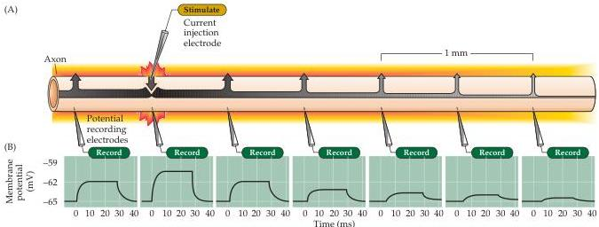
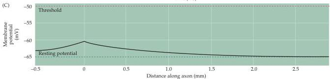
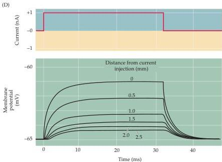

Chapter Three

Figure 3.10 Passive current flow in an axon.
(A) Experimental arrangement for examining the local flow of electrical current in an axon.
A current-passing electrode produces a subthreshold change in membrane potential, which spreads passively along the axon.
(B) Potential responses recorded at the positions indicated by microelectrodes.
With increasing distance from the site of current injection, the amplitude of the potential change is attenuated.
(C) Relationship between the amplitude of potential responses and distance.
(D) Superimposed responses (from B) to current pulse, measured at indicated distances along axon.
Note that the responses develop more slowly at greater distances from the site of current injection, for reasons explained in Box C.
(After Hodgkin and Rushton, 1938.)

If the experiment shown in Figure 3.10 is repeated with a depolarizing current pulse large enough to produce an action potential, the result is dramatically different (Figure 3.11A).
In this case, an action potential occurs without decrement along the entire length of the axon, which in humans