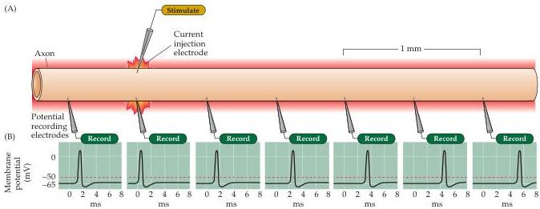
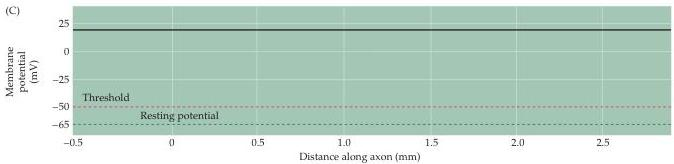

Voltage-Dependent Membrane Permeability

Figure 3.11 Propagation of an action potential.
(A) In this experimental arrangement, an electrode evokes an action potential by injecting a suprathreshold current.
(B) Potential responses recorded at the positions indicated by microelectrodes.
The amplitude of the action potential is constant along the length of the axon, although the time of appearance of the action potential is delayed with increasing distance.
(C) The constant amplitude of an action potential (solid black line) measured at different distances.

may be a distance of a meter or more (Figure 3.11B).
Thus, action potentials somehow circumvent the inherent leakiness of neurons.

How, then, do action potentials traverse great distances along such a poor passive conductor? The answer is in part provided by the observation that the amplitude of the action potentials recorded at different distances is constant.
This all-or-none behavior indicates that more than simple passive flow of current must be involved in action potential propagation.
A second clue comes from examination of the time of occurrence of the action potentials recorded at different distances from the site of stimulation: Action potentials occur later and later at greater distances along the axon (Figure 3.11B).
Thus, the action potential has a measurable rate of transmission, called the conduction velocity.
The delay in the arrival of the action potential at successively more distant points along the axon differs from the case shown in Figure 3.10, in which the electrical changes produced by passive current flow occur at more or less the same time at successive points.

The mechanism of action potential propagation is easy to grasp once one understands how action potentials are generated and how current passively flows along an axon (Figure 3.12).
A depolarizing stimulus—a synaptic potential or a receptor potential in an intact neuron, or an injected current pulse in an experiment—locally depolarizes the axon, thus opening the voltage-sensitive  $\mathrm{Na^{+}}$  channels in that region.
The opening of  $\mathrm{Na^{+}}$  channels causes inward movement of  $\mathrm{Na^{+}}$ , and the resultant depolarization of the membrane potential generates an action potential at that site.
Some of the local current generated by the action potential will then flow passively down