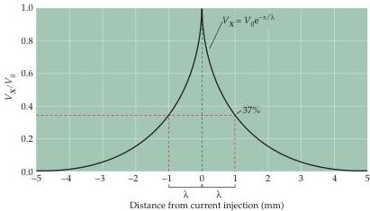

Chapter Three

# Box C

## Passive Membrane Properties

The passive flow of electrical current plays a central role in action potential propagation, synaptic transmission, and all other forms of electrical signaling in nerve cells.
Therefore, it is worthwhile understanding in quantitative terms how passive current flow varies with distance along a neuron.
For the case of a cylindrical axon, such as the one depicted in Figure 3.10, subthreshold current injected into one part of the axon spreads passively along the axon until the current is dissipated by leakage out across the axon membrane.
The decrement in the current flow with distance (Figure A) is described by a simple exponential function:

$$
V _ {x} = V _ {0} \mathrm {e} ^ {- x / \lambda}
$$

where $V_{x}$ is the voltage response at any distance $x$ along the axon, $V_{0}$ is the voltage change at the point where current is injected into the axon, e is the base of natural logarithms (approximately 2.7), and $\lambda$ is the length constant of the axon.
As evident in this relationship, the length constant is the distance where the initial voltage response $(V_{0})$ decays to $1 / \mathrm{e}$ (or $37\%$) of its value.
The length constant is thus a way to characterize how far passive current flow spreads before it leaks out of the axon, with leakier axons having shorter length constants.

The length constant depends upon the physical properties of the axon, in particular the relative resistances of the

plasma membrane $(r_{\mathrm{m}})$, the intracellular axoplasm $(r_{\mathrm{i}})$, and the extracellular medium $(r_{\mathrm{e}})$.
The relationship between these parameters is:

$$
\lambda = \sqrt {\frac {r _ {\mathrm {m}}}{r _ {0} + r _ {\mathrm {i}}}}
$$

Hence, to improve the passive flow of current along an axon, the resistance of the plasma membrane should be as high as possible and the resistances of the axoplasm and extracellular medium should be low.

Another important consequence of the passive properties of neurons is that currents flowing across a membrane do not immediately change the membrane potential.
For example, when a rectangular current pulse is injected into the axon shown in the experiment illustrated in Figure 3.10A, the membrane potential depolarizes slowly over a few milliseconds and then repolarizes over a similar time course when the current pulse ends (see Figure 3.10D).
These delays in changing the membrane potential are due to the fact that the plasma mem

(A) Spatial decay of membrane potential along a cylindrical axon.
A current pulse injected at one point in the axon (0 mm) produces voltage responses $(V_{x})$ that decay exponentially with distance.
The distance where the voltage response is $1 / \mathrm{e}$ of its initial value $(V_{0})$ is the length constant, $\lambda$.

the axon, in the same way that subthreshold currents spread along the axon (see Figure 3.10).
Note that this passive current flow does not require the movement of $\mathrm{Na^{+}}$ along the axon but, instead, occurs by a shuttling of charge, somewhat similar to what happens when wires passively conduct electricity by transmission of electron charge.
This passive current flow depolarizes the membrane potential in the adjacent region of the axon, thus opening the $\mathrm{Na^{+}}$ channels in the neighboring membrane.
The local depolarization triggers an action potential in this region, which then spreads again in a continuing cycle until the end of the axon is reached.
Thus, action potential propagation requires the coordinated action of two forms of current