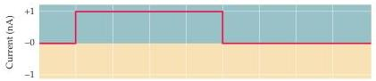
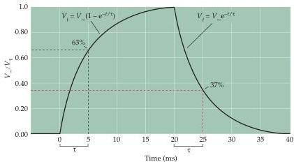

Voltage-Dependent Membrane Permeability

(B) Time course of potential changes produced in a spatially uniform cell by a current pulse.
The rise and fall of the membrane potential  $(V_{\mathrm{f}})$  can be described as exponential functions, with the time constant  $\tau$  defining the time required for the response to rise to  $1 - (1 / \mathrm{e})$  of the steady-state value  $(V_{\infty})$ , or to decline to  $1 / \mathrm{e}$  of  $V_{\infty}$ .

brane behaves as a capacitor, storing the initial charge that flows at the beginning and end of the current pulse.
For the case of a cell whose membrane potential is spatially uniform, the change in the membrane potential at any time,  $V_{\mathrm{f}}$ , after beginning the current pulse (Figure B) can also be described by an exponential relationship:

$$
V _ {\mathrm {f}} = V _ {\infty} \left(1 - \mathrm {e} ^ {- t / \tau}\right)
$$

where  $V_{\infty}$  is the steady-state value of the

membrane potential change,  $t$  is the time after the current pulse begins, and  $\tau$  is the membrane time constant.
The time constant is thus defined as the time when the voltage response  $(V_{\mathrm{f}})$  rises to  $1 - (1 / \mathrm{e})$  (or  $63\%$  ) of  $V_{\infty}$ .
After the current pulse ends, the membrane potential change also declines exponentially according to the relationship

$$
V _ {\mathrm {f}} = V _ {\infty} \mathrm {e} ^ {- t / \tau}
$$

During this decay, the membrane poten

tial returns to  $1 / \mathrm{e}$  of  $V_{\infty}$  at a time equal to  $t$ .
For cells with more complex geometries than the axon in Figure 3.10, the time courses of the changes in membrane potential are not simple exponentials, but nonetheless depend on the membrane time constant.
Thus, the time constant characterizes how rapidly current flow changes the membrane potential.
The membrane time constant also depends on the physical properties of the nerve cell, specifically on the resistance  $(r_{\mathrm{m}})$  and capacitance  $(c_{\mathrm{m}})$  of the plasma membrane such that:

$$
\tau = r _ {\mathrm {m}} c _ {\mathrm {m}}
$$

The values of  $r_{\mathrm{m}}$  and  $c_{\mathrm{m}}$  depend, in part, on the size of the neuron, with larger cells having lower resistances and larger capacitances.
In general, small nerve cells tend to have long time constants and large cells brief time constants.

# References

HODGKIN, A.
L.
AND W.
A.
H.
RUSHTON (1938) The electrical constants of a crustacean nerve fibre.
Proc.
R.
Soc.
Lond.
133: 444-479.
JOHNSTON, D.
AND S.
M.-S.
WU (1995) Foundations of Cellular Neurophysiology.
Cambridge, MA: MIT Press.
RALL, W.
(1977) Core conductor theory and cable properties of neurons.
In Handbook of Physiology, Section 1: The Nervous System, Vol.
1: Cellular Biology of Neurons.
E.
R.
Kandel (ed.).
Bethesda, MD: American Physiological Society, pp.
39-98.

flow—the passive flow of current as well as active currents flowing through voltage-dependent ion channels.
The regenerative properties of  $\mathrm{Na^{+}}$  channel opening allow action potentials to propagate in an all-or-none fashion by acting as a booster at each point along the axon, thus ensuring the long-distance transmission of electrical signals.

# The Refractory Period

Recall that the depolarization that produces  $\mathrm{Na^{+}}$  channel opening also causes delayed activation of  $\mathrm{K}^+$  channels and  $\mathrm{Na^{+}}$  channel inactivation, lead