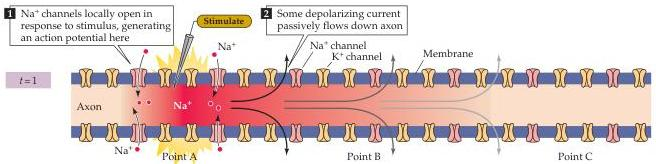
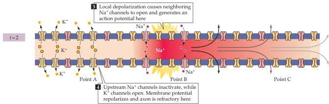
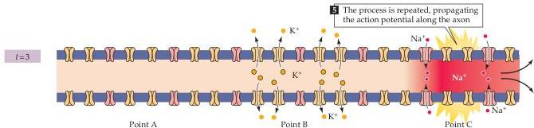
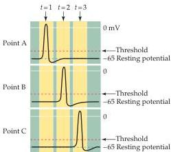

Chapter Three

Figure 3.12 Action potential conduction requires both active and passive current flow.
Depolarization opens  $\mathrm{Na^{+}}$  channels locally and produces an action potential at point A of the axon (time  $t = 1$ ).
The resulting inward current flows passively along the axon, depolarizing the adjacent region (point B) of the axon.
At a later time ( $t = 2$ ), the depolarization of the adjacent membrane has opened  $\mathrm{Na^{+}}$  channels at point B, resulting in the initiation of the action potential at this site and additional inward current that again spreads passively to an adjacent point (point C) farther along the axon.
At a still later time ( $t = 3$ ), the action potential has propagated even farther.
This cycle continues along the full length of the axon.
Note that as the action potential spreads, the membrane potential repolarizes due to  $\mathrm{K^{+}}$  channel opening and  $\mathrm{Na^{+}}$  channel inactivation, leaving a "wake" of refractoriness behind the action potential that prevents its backward propagation (panel 4).
The panel to the left of this figure legend shows the time course of membrane potential changes at the points indicated.