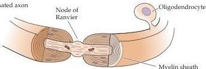
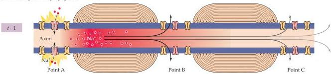
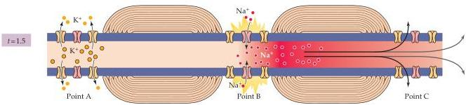
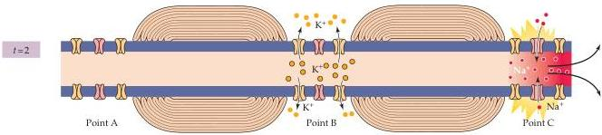
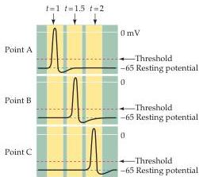

(A) Myelinated axon

(B) Action potential propagation

Figure 3.13 Saltatory action potential conduction along a myelinated axon.
(A) Diagram of a myelinated axon.
(B) Local current in response to action potential initiation at a particular site flows locally, as described in Figure 3.12.
However, the presence of myelin prevents the local current from leaking across the internodal membrane; it therefore flows farther along the axon than it would in the absence of myelin.
Moreover, voltage-gated  $\mathrm{Na^{+}}$  channels are present only at the nodes of Ranvier ( $\mathbf{K}^+$  channels are present at the nodes of some neurons, but not others).
This arrangement means that the generation of active, voltage-gated  $\mathrm{Na^{+}}$  currents need only occur at these unmyelinated regions.
The result is a greatly enhanced velocity of action potential conduction.
The panel to the left of this figure legend shows the time course of membrane potential changes at the points indicated.