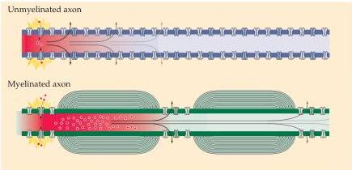
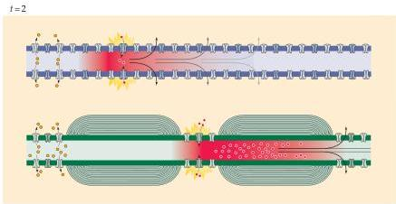
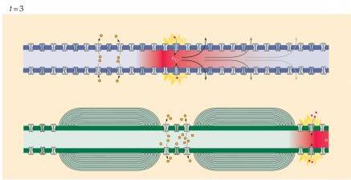

Voltage-Dependent Membrane Permeability

Figure 3.14 Comparison of speed of action potential conduction in unmyelinated (upper) and myelinated (lower) axons.

# Summary

The action potential and all its complex properties can be explained by time- and voltage-dependent changes in the  $\mathrm{Na^{+}}$  and  $\mathbf{K}^+$  permeabilities of neuronal membranes.
This conclusion derives primarily from evidence obtained by a device called the voltage clamp.
The voltage clamp technique is an electronic feedback method that allows control of neuronal membrane potential